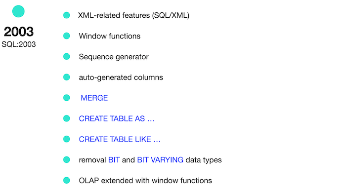

# День 00 - Интенсив SQL

## _Реляционная модель данных и SQL_

Резюме: Сегодня вы увидите, как работает реляционная модель и как получить необходимые данные на основе базовых конструкций SQL.

## Содержание

1. [Глава I](#chapter-i) \
    1.1. [Преамбула](#preamble)
2. [Глава II](#chapter-ii) \
    2.1. [Основные правила](#general-rules)
3. [Глава III](#chapter-iii) \
    3.1. [Правила дня ](#rules-of-the-day)  
4. [Глава IV](#chapter-iv) \
    4.1. [Упражнение 00 - Первые шаги в мир SQL](#exercise-00-first-steps-into-sql-world)  
5. [Глава V](#chapter-v) \
    5.1. [Упражнение 01 - Первые шаги в мир SQL](#exercise-01-first-steps-into-sql-world)  
6. [Глава VI](#chapter-vi) \
    6.1. [Упражнение 02 - Первые шаги в мир SQL](#exercise-02-first-steps-into-sql-world)  
7. [Глава VII](#chapter-vii) \
    7.1. [Упражнение 03 - Первые шаги в мир SQL](#exercise-03-first-steps-into-sql-world)  
8. [Глава VIII](#chapter-viii) \
    8.1. [Упражнение 04 - Первые шаги в мир SQL](#exercise-04-first-steps-into-sql-world)
9. [Глава IX](#chapter-ix) \
    9.1. [Упражнение 05 - Первые шаги в мир SQL](#exercise-05-first-steps-into-sql-world)
10. [Глава X](#chapter-x) \
    10.1. [Упражнение 06 - Первые шаги в мир SQL](#exercise-06-first-steps-into-sql-world)
11. [Глава XI](#chapter-xi) \
    11.1. [Упражнение 07 - Первые шаги в мир SQL](#exercise-07-first-steps-into-sql-world)
12. [Глава XII](#chapter-xii) \
    12.1. [Упражнение 08 - Первые шаги в мир SQL](#exercise-08-first-steps-into-sql-world)
13. [Глава XIII](#chapter-xiii) \
    13.1. [Упражнение 09 - Первые шаги в мир SQL](#exercise-09-first-steps-into-sql-world)

## Глава I
## Преамбула


Стандарты повсюду, и реляционные базы данных тоже под контролем :-). Честно говоря, более ограниченные стандарты SQL были в начале 2000-х годов. На самом деле, когда родился паттерн «Большие данные», у реляционных баз данных был свой способ реализации этого паттерна, и поэтому стандарты сейчас более… легковесны. 


Ознакомьтесь с приведенными ниже стандартами SQL и подумайте о будущем реляционных баз данных.

|  |  |
| ------ | ------ |
|  |  |
|  |  |
|  |  |

## Глава II
## Основные правила

- Используйте эту страницу как единственную инструкцию. Не слушайте никаких слухов и домыслов о том, как подготовить своё решение.
- Пожалуйста, убедитесь, что вы используете последнюю версию PostgreSQL.
- Это совершенно нормально, если вы используете IDE для написания исходного кода (он же SQL-скрипт).
- Для оценки ваше решение должно находиться в вашем репозитории GIT.
- Ваши решения будут оценены вашими товарищами по интенсиву.
- Вы не должны оставлять в своем каталоге никаких других файлов, кроме тех, которые явно указаны в инструкциях к упражнению. Рекомендуется изменить ваш .gitignoreчтобы избежать случайностей.
- У вас есть вопрос? Спросите у соседа справа. Если не помогло - попробуйте с соседом слева.
- Ваш справочник: товарищи/интернет/гугл.
- Внимательно прочитайте примеры. Они могут понять вещи, которые иначе не указаны в задании. 
- И да прибудет с вами сила SQL!
- Абсолютно все можно представить в SQL! Давайте начнем и получайте удовольствие!

## Глава III
## Правила дня

- Убедитесь, что у вас есть собственная база данных и доступ к ней в вашем кластере PostgreSQL.
- Загрузите скрипт (materials/model.sql) с моделью базы данных здесь и примените его к своей базе данных (вы можете использовать командную строку с psql или просто запустить его через любую IDE, например DataGrip от JetBrains или pgAdmin от сообщества PostgreSQL).
- Все задачи содержат список разрешенных и запрещенных разделов с перечисленными параметрами базы данных, типами баз данных, конструкциями SQL и т. д. Пожалуйста, ознакомьтесь с разделом перед началом.
- Пожалуйста, взгляните на логическое представление нашей модели базы данных.


1. Таблица **pizzeria** (Таблица-словарь с доступными пиццериями)
- поле ``id`` - первичный ключ (primary key)
- поле ``name`` - название пиццерии
- поле ``rating`` - средний рейтинг пиццерии (от 0 до 5 баллов)
2. Таблица **person** (Таблица-словарь с людьми, которые любят пиццу)
- поле ``id`` - первичный ключ (primary key)
- поле ``name`` - имя человека
- поле ``age`` - возраст человека
- поле ``gender`` - пол человека
- поле ``address`` - адрес человека
3. Таблица **menu** (Таблица-словарь с доступным меню и ценой на конкретную пиццу)
- поле ``id`` - первичный ключ (primary key)
- поле ``pizzeria_id`` - внешний ключ к пиццерии
- поле ``pizza_name`` - название пиццы в пиццерии
- поле ``price`` - цена конкретной пиццы
4. Таблица **person_visits** (Операционная таблица с информацией о посещениях пиццерии)
- поле ``id`` - первичный ключ (primary key)
- поле ``person_id`` - внешний ключ к человеку
- поле ``pizzeria_id`` - внешний ключ к пиццерии
- поле ``visit_date`` - дата (например 2022-01-01) посещения пиццерии человеком
5. Таблица **person_order** (операционная таблица с информацией о заказах людей)
- поле ``id`` - первичный ключ (primary key)
- поле ``person_id`` - внешний ключ к человеку
- поле ``menu_id`` - внешний ключ к меню
- поле ``order_date`` - дата (например 2022-01-01) заказа человека

Посещение (visit_date) и заказ (order_date) - это разные сущности, и нет никакой корреляции между их данными. Например, клиент может находиться в одном месте (просто просматривая меню) и в это время сделать заказ в другом по телефону или с помощью мобильного приложения. Или позвонить из дома с заказом без каких-либо визитов.

## Глава IV
## Упражнение 00 - Первые шаги в мир SQL

| Упражнение 00: Первые шаги в мир SQL |                                                                                                                          |
|---------------------------------------|--------------------------------------------------------------------------------------------------------------------------|
| Каталог для сдачи                    | ex00                                                                                                                     |
| Файлы для сдачи                      | `day00_ex00.sql`                                                                                 |
| **Разрешено**                               |                                                                                                                          |
| Язык                        | ANSI SQL                                                                                              |

Давайте сделаем нашу первую задачу. Пожалуйста, сделайте оператор выбора, который возвращает имя человека и возраст человека из города «Казань».

## Глава V
## Упражнение 01 - Первые шаги в мир SQL

| Упражнение 01: Первые шаги в мир SQL |                                                                                                                          |
|---------------------------------------|--------------------------------------------------------------------------------------------------------------------------|
| Каталог для сдачи                     | ex01                                                                                                                     |
| Файлы для сдачи                      | `day00_ex01.sql`                                                                                 |
| **Разрешено**                               |                                                                                                                          |
| Язык                        | ANSI SQL                                                                                              |

Пожалуйста, сделайте оператор выбора, который возвращает имя и возраст человека из города «Казань», если его пол - «женский». Да, и, пожалуйста, добавьте сортировку по имени человека.

## Глава VI
## Упражнение 02 - Первые шаги в мир SQL

| Упражнение 02: Первые шаги в мир SQL |                                                                                                                          |
|---------------------------------------|--------------------------------------------------------------------------------------------------------------------------|
| Каталог для сдачи                     | ex02                                                                                                                     |
| Файлы для сдачи                      | `day00_ex02.sql`                                                                                 |
| **Разрешено**                               |                                                                                                                          |
| Язык                        | ANSI SQL                                                                                              |

Пожалуйста, сделайте 2 оператора выбора с разными синтаксисом, которые возвращают список пиццерий (название пиццерии и рейтинг) с рейтингом от 3,5 до 5 баллов (включая интервалы) и упорядочивание по рейтингу пиццерии.
- 1-й оператор select должен содержать знаки для сравнения (<=, =>)
- второй оператор выбора должен содержать ключевое слово `BETWEEN`

## Глава VII
## Упражнение 03 - Первые шаги в мир SQL

| Упражнение 03: Первые шаги в мир SQL |                                                                                                                          |
|---------------------------------------|--------------------------------------------------------------------------------------------------------------------------|
| Каталог для сдачи                     | ex03                                                                                                                     |
| Файлы для сдачи                      | `day00_ex03.sql`                                                                                 |
| **Разрешено**                               |                                                                                                                          |
| Язык                        | ANSI SQL                                                                                              |

Пожалуйста, сделайте оператор select, который возвращает идентификатор человека (без дублирования), который посещает пиццерии в течение 6 января 2022 г. и 9 января 2022 г. или посещает пиццерию с идентификатором 2. Также отсортируйте данные по идентификатору человека в порядке убывания.

## Глава VIII
## Упражнение 04 - Первые шаги в мир SQL


| Упражнение 04: Первые шаги в мир SQL |                                                                                                                          |
|---------------------------------------|--------------------------------------------------------------------------------------------------------------------------|
| Каталог для сдачи                     | ex04                                                                                                                     |
| Файлы для сдачи                      | `day00_ex04.sql`                                                                                 |
| **Разрешено**                               |                                                                                                                          |
| Язык                        | ANSI SQL                                                                                              |

Пожалуйста, сделайте оператор select, который возвращает одно предварительно вычисленное поле с именем «person_information» в одной строке, как описано в следующем примере:

`Anna (age:16,gender:'female',address:'Moscow')`

Наконец, добавьте предложение сортировку в порядке возрастания по этому предварительно вычисляемому столбцу. Обратите внимание на кавычки в формуле! 

## Глава IX
## Упражнение 05 - Первые шаги в мир SQL


| Упражнение 05: Первые шаги в мир SQL |                                                                                                                          |
|---------------------------------------|--------------------------------------------------------------------------------------------------------------------------|
| Каталог для сдачи                     | ex05                                                                                                                     |
| Файлы для сдачи                      | `day00_ex05.sql`                                                                                 |
| **Разрешено**                               |                                                                                                                          |
| Язык                        | ANSI SQL                                                                                              |
| **Запрещено**                               |                                           
| Синтаксические конструкции SQL                        | `IN`, any types of `JOINs`                                                                                              |

Пожалуйста, сделайте оператор select, который возвращает имена людей (на основе внутреннего запроса в предложении `SELECT`), которые сделали заказы на меню с идентификаторами 13, 14 и 18, а дата заказа должна быть равна 7 января 2022 года.

Пожалуйста, взгляните на шаблон внутреннего запроса.

```
SELECT 
    (SELECT ... ) AS NAME  -- this is an internal query in a main SELECT clause
FROM ...
WHERE ...
```

## Глава X
## Упражнение 06 - Первые шаги в мир SQL


| Упражнение 06: Первые шаги в мир SQL |                                                                                                                          |
|---------------------------------------|--------------------------------------------------------------------------------------------------------------------------|
| Каталог для сдачи                     | ex06                                                                                                                     |
| Файлы для сдачи                      | `day00_ex06.sql`                                                                                 |
| **Разрешено**                               |                                                                                                                          |
| Язык                        | ANSI SQL                                                                                              |
| **Запрещено**                               |                                           
| Синтаксические конструкции SQL                       | `IN`, any types of `JOINs`                                                                                              |

Пожалуйста, используйте конструкцию SQL из упражнения 05 и добавьте новый вычисляемый столбец (задайте имя = 'check_name') с оператором проверки (псевдокод для этой проверки представлен ниже) в предложении  `SELECT`.

```
    if (person_name == 'Denis') then return true
        else return false
```

## Глава XI
## Упражнение 07 - Первые шаги в мир SQL


| Упражнение 07: Первые шаги в мир SQL |                                                                                                                          |
|---------------------------------------|--------------------------------------------------------------------------------------------------------------------------|
| Каталог для сдачи                     | ex07                                                                                                                     |
| Файлы для сдачи                      | `day00_ex07.sql`                                                                                 |
| **Разрешено**                               |                                                                                                                          |
| Язык                        | ANSI SQL                                                                                              |

Применим интервалы данных для таблицы `person`. 
Пожалуйста, сделайте оператор SQL, который возвращает идентификатор человека, имя человека и интервал возраста человека (задайте имя нового вычисляемого столбца как «интервал») на основе приведенного ниже псевдокода.

```
    if (age >= 10 and age <= 20) then return 'interval #1'
    else if (age > 20 and age < 24) then return 'interval #2'
    else return 'interval #3'
```

и да... пожалуйста, добавьте сортировку по возрастанию по столбцу "интервал".

## Глава XII
## Упражнение 08 - Первые шаги в мир SQL


| Упражнение 08: Первые шаги в мир SQL |                                                                                                                          |
|---------------------------------------|--------------------------------------------------------------------------------------------------------------------------|
| Каталог для сдачи                     | ex08                                                                                                                     |
| Файлы для сдачи                      | `day00_ex08.sql`                                                                                 |
| **Разрешено**                               |                                                                                                                          |
| Язык                        | ANSI SQL                                                                                              |

Пожалуйста, сделайте оператор SQL, который возвращает все столбцы из таблицы ``person_order``, но строки, идентификатор которых является четным числом, и выведите данные в порядке возрастания. 

## Глава XIII
## Упражнение 09 - Первые шаги в мир SQL


| Упражнение 09: Первые шаги в мир SQL |                                                                                                                          |
|---------------------------------------|--------------------------------------------------------------------------------------------------------------------------|
| Каталог для сдачи                     | ex09                                                                                                                     |
| Файлы для сдачи                     | `day00_ex09.sql`                                                                                 |
| **Разрешено**                               |                                                                                                                          |
| Язык                        | ANSI SQL                                                                                              |
| **Запрещено**                               |                                           
| Синтаксические конструкции SQL                       | any types of `JOINs`                                                                                              |

Пожалуйста, сделайте оператор select, который возвращает имена людей и названия пиццерий на основе таблицы `person_visit` с датами посещения в промежутке с 07 января по 09 января 2022 года (на основе внутреннего запроса в предложении FROM).

Пожалуйста, взгляните на шаблон окончательного запроса.

```
    SELECT (...) AS person_name ,  -- this is an internal query in a main SELECT clause
            (...) AS pizzeria_name  -- this is an internal query in a main SELECT clause
    FROM (SELECT … FROM person_visits WHERE …) AS pv -- this is an internal query in a main FROM clause
    ORDER BY ...
```

Пожалуйста, добавьте пункт заказа по имени человека по возрастанию и по названию пиццерии по убыванию.

