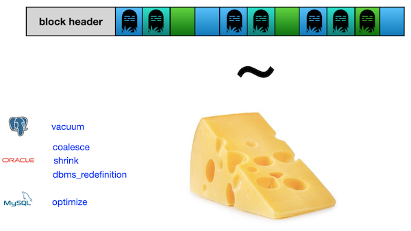

# Day 03 - Piscine SQL

## _Continuing to JOIN and make change in data_

Resume: Today you will see how to change data based on DML Язык

## Contents

1. [Глава I](#chapter-i) \
    1.1. [Преамбула](#preamble)
2. [Глава II](#chapter-ii) \
    2.1. [Основные правила](#general-rules)
3. [Глава III](#chapter-iii) \
    3.1. [Правила дня](#rules-of-the-day)  
4. [Глава IV](#chapter-iv) \
    4.1. [Упражнение 00 - Найдем подходящие цены для Кати](#exercise-00-lets-find-appropriate-prices-for-kate)  
5. [Глава V](#chapter-v) \
    5.1. [Упражнение 01 - Найдем забытые меню](#exercise-01-lets-find-forgotten-menus)  
6. [Глава VI](#chapter-vi) \
    6.1. [Упражнение 02 - Найдем забытую пиццу и пиццерию](#exercise-02-lets-find-forgotten-pizza-and-pizzerias)  
7. [Глава VII](#chapter-vii) \
    7.1. [Упражнение 03 - Сравним посещения](#exercise-03-lets-compare-visits)  
8. [Глава VIII](#chapter-viii) \
    8.1. [Упражнение 04 - Сравним заказы](#exercise-04-lets-compare-orders)
9. [Глава IX](#chapter-ix) \
    9.1. [Упражнение 05 - Посетил, но не сделал никакого заказа](#exercise-05-visited-but-did-not-make-any-order)
10. [Глава X](#chapter-x) \
    10.1. [Упражнение 06 - Найдите пиццу по сходству цен](#exercise-06-find-price-similarity-pizzas)
11. [Глава XI](#chapter-xi) \
    11.1. [Упражнение 07 - Давайте приготовим новый вид пиццы](#exercise-07-lets-cook-a-new-type-of-pizza)
12. [Глава XII](#chapter-xii) \
    12.1. [Упражнение 08 - Давайте приготовим новый вид пиццы с большей динамикой](#exercise-08-lets-cook-a-new-type-of-pizza-with-more-dynamics)
13. [Глава XIII](#chapter-xiii) \
    13.1. [Упражнение 09 - Новая пицца означает новые посещения](#exercise-09-new-pizza-means-new-visits)
14. [Глава XIV](#chapter-xiv) \
    14.1. [Упражнение 10 - Новые посещения означают новые заказы](#exercise-10-new-visits-means-new-orders)
15. [Глава XV](#chapter-xv) \
    15.1. [Упражнение 11 - «Улучшить» цену для клиентов](#exercise-11-improve-a-price-for-clients)    
16. [Глава XVI](#chapter-xvi) \
    16.1. [Упражнение 12 - Приходят новые заказы!](#exercise-12-new-orders-are-coming)
17. [Глава XVII](#chapter-xvii) \
    17.1. [Упражнение 13 - Возврат денег нашим клиентам](#exercise-13-money-back-to-our-customers)

## Глава I
## Преамбула

Теория отношений — это математическая основа современных реляционных баз данных. Каждый аспект баз данных имеет соответствующее математическое и логическое обоснование. Включая операторы INSERT/UPDATE/DELETE. (На снимке доктор Эдгар Фрэнк Кодд).

Как работает оператор INSERT с математической точки зрения.

|  |  |
| ------ | ------ |
|`INSERT rel RELATION {TUPLE {A INTEGER(4),B INTEGER(4),C STRING ('Hello') }};` | Вы можете использовать математические операторы INSERT и интегрировать конструкцию «кортежа» для преобразования входящих данных в строку. |
| С другой стороны, вы можете использовать явное присваивание с оператором UNION. | `rel:=rel UNION RELATION {TUPLE {A INTEGER(4), B INTEGER (7), C STRING ('Hello')}};` |

Что насчет оператора DELETE?

|  |  |
| ------ | ------ |
|`DELETE rel WHERE A = 1;` | Если вы хотите удалить строку для A = 1, вы можете сделать это прямым способом. |
| ... или используя новое назначение без ключа A = 1 | `rel:=rel WHERE NOT (A = 1);` |

... и, наконец, оператор UPDATE. Также есть 2 случая.

|  |  |
| ------ | ------ |
|`UPDATE rel WHERE A = 1 {B:= 23*A, C:='String #4'};` | Оператор обновления с математической точки зрения |
| Новое назначение для переменной отношения rel на основе CTE и работы с наборами | `rel:=WITH (rel WHERE A = 1) AS T1, (EXTEND T1 ADD (23*A AS NEW_B, 'String #4' AS NEW_C)) AS T2, T2 {ALL BUT B,C} AS T3, (T3 RENAME (NEW _B AS B, NEW _C AS C)) AS T4: (S MINUS T1) UNION T4;` |

Последний случай с оператором UPDATE действительно интересен, потому что, другими словами, вы добавляете новый кортеж, а после этого делаете МИНУС старой строки. Такое же поведение в физической реализации! На самом деле, `UPDATE = DELETE + INSERT` и есть специальный статус «Надгробие» для конкретной удаленной/обновленной строки. Тогда, если у вас много надгробий, у вас плохая метрика TPS, и вам нужно контролировать свои мертвые данные!

Давайте сделаем сыр из наших данных! :-)

## Глава II
## Основные правила

- Используйте эту страницу как единственную инструкцию. Не слушайте никаких слухов и домыслов о том, как подготовить своё решение.
- Пожалуйста, убедитесь, что вы используете последнюю версию PostgreSQL.
- Это совершенно нормально, если вы используете IDE для написания исходного кода (он же SQL-скрипт).
- Для оценки ваше решение должно находиться в вашем репозитории GIT.
- Ваши решения будут оценены вашими товарищами по интенсиву.
- Вы не должны оставлять в своем каталоге никаких других файлов, кроме тех, которые явно указаны в инструкциях к упражнению. Рекомендуется изменить ваш .gitignoreчтобы избежать случайностей.
- У вас есть вопрос? Спросите у соседа справа. Если не помогло - попробуйте с соседом слева.
- Ваш справочник: товарищи/интернет/гугл.
- Внимательно прочитайте примеры. Они могут понять вещи, которые иначе не указаны в задании. 
- И да прибудет с вами сила SQL!
- Абсолютно все можно представить в SQL! Давайте начнем и получайте удовольствие!

## Глава III
## Правила дня

- Убедитесь, что у вас есть собственная база данных и доступ к ней в вашем кластере PostgreSQL.
- Загрузите скрипт (materials/model.sql) с моделью базы данных здесь и примените его к своей базе данных (вы можете использовать командную строку с psql или просто запустить его через любую IDE, например DataGrip от JetBrains или pgAdmin от сообщества PostgreSQL).
- Все задачи содержат список разрешенных и запрещенных разделов с перечисленными параметрами базы данных, типами баз данных, конструкциями SQL и т. д. Пожалуйста, ознакомьтесь с разделом перед началом.
- Пожалуйста, взгляните на логическое представление нашей модели базы данных.

1. Таблица **pizzeria** (Таблица-словарь с доступными пиццериями)
- поле ``id`` - первичный ключ (primary key)
- поле ``name`` - название пиццерии
- поле ``rating`` - средний рейтинг пиццерии (от 0 до 5 баллов)
2. Таблица **person** (Таблица-словарь с людьми, которые любят пиццу)
- поле ``id`` - первичный ключ (primary key)
- поле ``name`` - имя человека
- поле ``age`` - возраст человека
- поле ``gender`` - пол человека
- поле ``address`` - адрес человека
3. Таблица **menu** (Таблица-словарь с доступным меню и ценой на конкретную пиццу)
- поле ``id`` - первичный ключ (primary key)
- поле ``pizzeria_id`` - внешний ключ к пиццерии
- поле ``pizza_name`` - название пиццы в пиццерии
- поле ``price`` - цена конкретной пиццы
4. Таблица **person_visits** (Операционная таблица с информацией о посещениях пиццерии)
- поле ``id`` - первичный ключ (primary key)
- поле ``person_id`` - внешний ключ к человеку
- поле ``pizzeria_id`` - внешний ключ к пиццерии
- поле ``visit_date`` - дата (например 2022-01-01) посещения пиццерии человеком
5. Таблица **person_order** (операционная таблица с информацией о заказах людей)
- поле ``id`` - первичный ключ (primary key)
- поле ``person_id`` - внешний ключ к человеку
- поле ``menu_id`` - внешний ключ к меню
- поле ``order_date`` - дата (например 2022-01-01) заказа человека

Посещение (visit_date) и заказ (order_date) - это разные сущности, и нет никакой корреляции между их данными. Например, клиент может находиться в одном месте (просто просматривая меню) и в это время сделать заказ в другом по телефону или с помощью мобильного приложения. Или позвонить из дома с заказом без каких-либо визитов.

## Глава IV
## Упражнение 00 - Найдем подходящие цены для Кати 

| Упражнение 00: Найдем подходящие цены для Кати  |                                                                                                                          |
|---------------------------------------|--------------------------------------------------------------------------------------------------------------------------|
| Каталог сдачи                     | ex00                                                                                                                     |
| Файлы для сдачи                      | `day03_ex00.sql`                                                                                 |
| **Разрешено**                               |                                                                                                                          |
| Язык                        | ANSI SQL                                                                                              |

Пожалуйста, напишите оператор SQL, который возвращает список названий пицц, цен на пиццы, названий пиццерий и дат посещения для Кати и цен в диапазоне от 800 до 1000 рублей. Сортируйте по пицце, цене и названию пиццерии. Взгляните на образец данных ниже.

| pizza_name | price | pizzeria_name | visit_date |
| ------ | ------ | ------ | ------ |
| cheese pizza | 950 | DinoPizza | 2022-01-04 |
| pepperoni pizza | 800 | Best Pizza | 2022-01-03 |
| pepperoni pizza | 800 | DinoPizza | 2022-01-04 |
| ... | ... | ... | ... |

## Глава V
## Упражнение 01 - Найдем забытые меню

| Упражнение 01: Найдем забытые меню |                                                                                                                          |
|---------------------------------------|--------------------------------------------------------------------------------------------------------------------------|
| Каталог сдачи                     | ex01                                                                                                                     |
| Файлы для сдачи                      | `day03_ex01.sql`                                                                                 |
| **Разрешено**                               |                                                                                                                          |
| Язык                        | ANSI SQL                                                                                              |
| **Запрещено**                               |                                                                                                                          |
| Синтаксические конструкции SQL                        | любой тип `JOIN`а                                                                                              |

Пожалуйста, найдите все идентификаторы меню, которые никем не заказаны. Результат должен быть отсортирован по идентификаторам. Пример выходных данных представлен ниже.

| menu_id |
| ------ |
| 5 |
| 10 |
| ... |

## Глава VI
## Упражнение 02 - Найдем забытую пиццу и пиццерию

| Упражнение 02: Найдем забытую пиццу и пиццерию |                                                                                                                          |
|---------------------------------------|--------------------------------------------------------------------------------------------------------------------------|
| Каталог сдачи                     | ex02                                                                                                                     |
| Файлы для сдачи                      | `day03_ex02.sql`                                                                                 |
| **Разрешено**                               |                                                                                                                          |
| Язык                        | ANSI SQL                                                                                              |

Пожалуйста, используйте оператор SQL из упражнения № 01 и покажите названия пицц из пиццерии, которые никто не заказывал, включая соответствующие цены. Результат должен быть отсортирован по названию пиццы и цене. Пример выходных данных представлен ниже. 

| pizza_name | price | pizzeria_name |
| ------ | ------ | ------ |
| cheese pizza | 700 | Papa Johns |
| cheese pizza | 780 | DoDo Pizza |
| ... | ... | ... |

## Глава VII
## Упражнение 03 - Сравним посещения

| Упражнение 03: Сравним посещения |                                                                                                                          |
|---------------------------------------|--------------------------------------------------------------------------------------------------------------------------|
| Каталог сдачи                     | ex03                                                                                                                     |
| Файлы для сдачи                      | `day03_ex03.sql`                                                                                 |
| **Разрешено**                               |                                                                                                                          |
| Язык                        | ANSI SQL                                                                                              |

Пожалуйста, найдите объединение пиццерий, которые посещают только женщины или только мужчины. Для любых операторов SQL с наборами сохраняйте дубликаты (`UNION ALL`, `EXCEPT ALL`, `INTERSECT ALL`конструкции). Пожалуйста, установите заказ по названию пиццерии. Пример набора выходных данных приведен ниже.

| pizzeria_name | 
| ------ | 
| Best Pizza | 
| Dominos |
| ... |

## Глава VIII
## Упражнение 04 - Сравним заказы

| Упражнение 04: Сравним заказы |                                                                                                                          |
|---------------------------------------|--------------------------------------------------------------------------------------------------------------------------|
| Каталог сдачи                     | ex04                                                                                                                     |
| Файлы для сдачи                      | `day03_ex04.sql`                                                                                 |
| **Разрешено**                               |                                                                                                                          |
| Язык                        | ANSI SQL                                                                                              |

Пожалуйста, найдите объединение пиццерий, которые принимают заказы либо от женщин, либо от мужчин. Другими словами, вы должны найти набор названий пиццерий, заказанных только женщинами, и выполнить операцию ``UNION`` с набором названий пиццерий, заказанных только мужчинами. Пожалуйста, обратите внимание на слово “только” для обоих полов. Для любых SQL-операторов с наборами не сохраняйте дубликаты (`UNION`, `EXCEPT`, `INTERSECT`).  Пожалуйста, отсортируйте результат по названию пиццерии. Образец данных приведен ниже.

| pizzeria_name | 
| ------ | 
| Papa Johns | 

## Глава IX
## Упражнение 05 - Посетил, но не сделал никакого заказа

| Упражнение 05: Посетил, но не сделал никакого заказа |                                                                                                                          |
|---------------------------------------|--------------------------------------------------------------------------------------------------------------------------|
| Каталог сдачи                     | ex05                                                                                                                     |
| Файлы для сдачи                      | `day03_ex05.sql`                                                                                 |
| **Разрешено**                               |                                                                                                                          |
| Язык                        | ANSI SQL                                                                                              |

Пожалуйста, напишите оператор SQL, который возвращает список пиццерий, которые Андрей посещал, но не делал заказов. Пожалуйста, заказывайте по названию пиццерии. Образец данных представлен ниже.

| pizzeria_name | 
| ------ | 
| Pizza Hut | 
| ... |

## Глава X
## Упражнение 06 - Найдите пиццу по сходству цен

| Упражнение 06: Найдите пиццу по сходству цен |                                                                                                                          |
|---------------------------------------|--------------------------------------------------------------------------------------------------------------------------|
| Каталог сдачи                     | ex06                                                                                                                     |
| Файлы для сдачи                      | `day03_ex06.sql`                                                                                 |
| **Разрешено**                               |                                                                                                                          |
| Язык                        | ANSI SQL                                                                                              |

Пожалуйста, найдите одинаковые названия пиццы, которые имеют одинаковую цену, но из разных пиццерий. Убедитесь, что результат упорядочен по названию пиццы. Образец данных представлен ниже. Пожалуйста, убедитесь, что ваши имена столбцов соответствуют именам столбцов ниже.

| pizza_name | pizzeria_name_1 | pizzeria_name_2 | price |
| ------ | ------ | ------ | ------ |
| cheese pizza | Best Pizza | Papa Johns | 700 |
| ... | ... | ... | ... |

## Глава XI
## Упражнение 07 - Давайте приготовим новый вид пиццы

| Упражнение 07: Давайте приготовим новый вид пиццы |                                                                                                                          |
|---------------------------------------|--------------------------------------------------------------------------------------------------------------------------|
| Каталог сдачи                     | ex07                                                                                                                     |
| Файлы для сдачи                      | `day03_ex07.sql`                                                                                 |
| **Разрешено**                               |                                                                                                                          |
| Язык                        | ANSI SQL                                                                                              |

Пожалуйста, зарегистрируйте новую пиццу с названием «Греческая пицца» (используйте id = 19) по цене 800 рублей в ресторане «Домино» (pizzeria_id = 2).
**Предупреждение**: это упражнение, вероятно, будет причиной неправильного изменения данных. Собственно восстановить исходную модель БД с данными можно по ссылке в разделе «Правила дня».

## Глава XII
## Упражнение 08 - Давайте приготовим новый вид пиццы с большей динамикой

| Упражнение 08: Давайте приготовим новый вид пиццы с большей динамикой |                                                                                                                          |
|---------------------------------------|--------------------------------------------------------------------------------------------------------------------------|
| Каталог сдачи                     | ex08                                                                                                                     |
| Файлы для сдачи                      | `day03_ex08.sql`                                                                                 |
| **Разрешено**                               |                                                                                                                          |
| Язык                        | ANSI SQL                                                                                              |           
| **Запрещено**                               |                                                                                                                          |
| SQL Syntax Pattern                        | Не используйте прямые номера для идентификаторов первичного ключа и пиццерии                                                                                               |       

Пожалуйста, зарегистрируйте новую пиццу с названием «сицилийская пицца» (id которой должен рассчитываться по формуле «максимальное значение id + 1») по цене 900 рублей в ресторане «Домино».
**Предупреждение**: это упражнение, вероятно, будет причиной неправильного изменения данных. Собственно, можно восстановить исходную модель БД с данными по ссылке в разделе «Правила дня» и воспроизвести скрипт из упражнения 07.

## Глава XIII
## Упражнение 09 - Новая пицца означает новые посещения

| Упражнение 09: Новая пицца означает новые посещения |                                                                                                                          |
|---------------------------------------|--------------------------------------------------------------------------------------------------------------------------|
| Каталог сдачи                     | ex09                                                                                                                     |
| Файлы для сдачи                      | `day03_ex09.sql`                                                                                 |
| **Разрешено**                               |                                                                                                                          |
| Язык                        | ANSI SQL                                                                                              |
| **Запрещено**                               |                                                                                                                          |
| SQL Syntax Pattern                        | Не используйте прямые номера для идентификаторов первичного ключа и пиццерии                                                                                              |       

Пожалуйста, зарегистрируйте новые посещения ресторана Domino's от Дениса и Ирины 24 февраля 2022 года.
**Предупреждение**: это упражнение, вероятно, будет причиной неправильного изменения данных. Собственно можно восстановить исходную модель БД с данными по ссылке в разделе «Правила дня» и переиграть скрипт из Упражнений 07 и 08.

## Глава XIV
## Упражнение 10 - Новые посещения означают новые заказы

| Exercise 10: Новые посещения означают новые заказы |                                                                                                                          |
|---------------------------------------|--------------------------------------------------------------------------------------------------------------------------|
| Каталог сдачи                     | ex10                                                                                                                     |
| Файлы для сдачи                      | `day03_ex10.sql`                                                                                 |
| **Разрешено**                               |                                                                                                                          |
| Язык                        | ANSI SQL                                                                                              |
| **Запрещено**                               |                                                                                                                          |
| SQL Syntax Pattern                        | Don’t use direct numbers for identifiers of Primary Key and pizzeria                                                                                               |     

Пожалуйста, регистрируйте новые заказы от Дениса и Ирины на 24 февраля 2022 года на новое меню с «сицилийской пиццей». **Предупреждение**: это упражнение, вероятно, будет причиной неправильного изменения данных. Собственно, можно восстановить исходную модель БД с данными по ссылке в разделе «Правила дня» и переиграть скрипт из Упражнений 07, 08 и 09.

## Глава XV
## Упражнение 11 - «Улучшить» цену для клиентов

| Exercise 11: «Улучшить» цену для клиентов|                                                                                                                          |
|---------------------------------------|--------------------------------------------------------------------------------------------------------------------------|
| Каталог сдачи                     | ex11                                                                                                                     |
| Файлы для сдачи                      | `day03_ex11.sql`                                                                                 |
| **Разрешено**                               |                                                                                                                          |
| Язык                        | ANSI SQL                                                                                              |

Пожалуйста, измените цену на «греческую пиццу» на -10% от текущей стоимости. 
**Предупреждение**: это упражнение, вероятно, будет причиной неправильного изменения данных. Собственно, можно восстановить исходную модель БД с данными по ссылке в разделе «Правила дня» и переиграть скрипт из Упражнений 07, 08, 09 и 10.

## Глава XVI
## Упражнение 12 - Приходят новые заказы!

| Exercise 12: Приходят новые заказы!|                                                                                                                          |
|---------------------------------------|--------------------------------------------------------------------------------------------------------------------------|
| Каталог сдачи                     | ex12                                                                                                                     |
| Файлы для сдачи                      | `day03_ex12.sql`                                                                                 |
| **Разрешено**                               |                                                                                                                          |
| Язык                        | ANSI SQL                                                                                              |
| Синтаксические конструкции SQL                        | `generate_series(...)`                                                                                              |
| Синтаксический шаблон SQL                        | Используйте шаблон “insert-select”
`INSERT INTO ... SELECT ...`|
| **Запрещено**                               |                                                                                                                          |
| Синтаксический шаблон SQL                        | - Не используйте прямые номера для идентификаторов первичного ключа и меню 
- Не используйте оконные функции, такие как `ROW_NUMBER( )`
- Не используйте атомарные операторы `INSERT` |

Пожалуйста, зарегистрируйте новые заказы от всех лиц на «греческую пиццу» 25 февраля 2022 года.
**Предупреждение**: это упражнение, вероятно, будет причиной неправильного изменения данных. Собственно, можно восстановить исходную модель БД данными по ссылке в разделе «Правила дня» и переиграть скрипт из Упражнений 07, 08, 09, 10 и 11.

## Глава XVII
## Упражнение 13 - Возврат денег нашим клиентам

| Exercise 13: Возврат денег нашим клиентам|                                                                                                                          |
|---------------------------------------|--------------------------------------------------------------------------------------------------------------------------|
| Каталог сдачи                     | ex13                                                                                                                     |
| Файлы для сдачи                      | `day03_ex13.sql`                                                                                 |
| **Разрешено**                               |                                                                                                                          |
| Язык                        | ANSI SQL                                                                                              |
    
Пожалуйста, напишите 2 оператора SQL (DML), которые удалят все заказы из упражнения № 12 на основе даты заказа, а затем полностью удалят «греческую пиццу» из меню.
**Предупреждение**: это упражнение, вероятно, будет причиной неправильного изменения данных. Собственно, можно восстановить исходную модель БД с данными по ссылке в разделе «Правила дня» и переиграть скрипт из Упражнений 07, 08, 09, 10, 11, 12 и 13. 