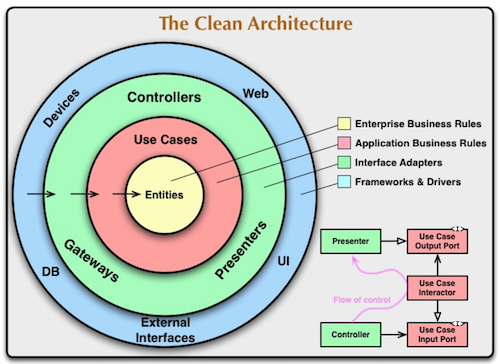

# Day 04 - Piscine SQL

## _Snapshots, virtual tables… What is going on?_

Resume: Today you will see how to use a virtual view and physical snapshot of data

## Contents

1. [Глава I](#chapter-i) \
    1.1. [Преамбула](#preamble)
2. [Глава II](#chapter-ii) \
    2.1. [Основные правила](#general-rules)
3. [Глава III](#chapter-iii) \
    3.1. [Правила дня](#rules-of-the-day)  
4. [Глава IV](#chapter-iv) \
    4.1. [Упражнение 00 - Давайте создадим отдельные представления для лиц](#exercise-00-lets-create-separated-views-for-persons)  
5. [Глава V](#chapter-v) \
    5.1. [Упражнение 01 - От частей к общему виду](#exercise-01-from-parts-to-common-view)  
6. [Глава VI](#chapter-vi) \
    6.1. [Упражнение 02 - «Хранение» сгенерированных дат в одном месте](#exercise-02-store-generated-dates-in-one-place)  
7. [Глава VII](#chapter-vii) \
    7.1. [Упражнение 03 - Найдите пропущенные дни посещения с помощью представления базы данных](#exercise-03-find-missing-visit-days-with-database-view)  
8. [Глава VIII](#chapter-viii) \
    8.1. [Упражнение 04 - Давайте найдем что-нибудь из теории множеств](#exercise-04-lets-find-something-from-set-theory)
9. [Глава IX](#chapter-ix) \
    9.1. [Упражнение 05 - Рассчитаем цену со скидкой для каждого человека](#exercise-05-lets-calculate-a-discount-price-for-each-person)
10. [Глава X](#chapter-x) \
    10.1. [Упражнение 06 - Материализация из виртуализации](#exercise-06-materialization-from-virtualization)
11. [Глава XI](#chapter-xi) \
    11.1. [Упражнение 07 - Обновите наше состояние](#exercise-07-refresh-our-state)
12. [Глава XII](#chapter-xii) \
    12.1. [Упражнение 08 - Просто очистите нашу базу данных](#exercise-08-just-clear-our-database)

## Глава I
## Преамбула

Зачем нужны виртуальные таблицы и материализованные представления в базах данных? Базы данных — это просто таблицы, не так ли? Нет, на самом деле нет. Базы данных аналогичны объектно-ориентированному языку. Вспомните, в Java много абстракций (я имею в виду интерфейсы Java). Нам нужна абстракция для достижения «Чистой архитектуры» и изменения объектов с минимальным влиянием на зависимости (иногда это работает :-).

Кроме того, в реляционной базе данных существует определенный шаблон архитектуры с именем ANSI/SPARK. Этот шаблон разбивает объекты на три уровня:

- внешний уровень
- концептуальный уровень
- внутренний уровень

Поэтому можно сказать, что виртуальные таблицы и материализованные представления — это физические интерфейсы между таблицами с данными и пользователем/приложением. Итак, в чем тогда разница между двумя объектами? Основное отличие заключается в «свежести данных». Ниже вы можете увидеть поведение этих объектов в графическом представлении. 

|  |  |
| ------ | ------ |
| Представление — это непрерывный объект с теми же данными, что и в базовых таблицах, которые используются для создания этого представления. Другими словами, если мы выбираем данные из представления, представление перенаправляет наш запрос к базовым объектам, а затем возвращает нам результаты. |  |
|  | Материализованное представление — это дискретный объект. Другими словами, нам нужно дождаться, когда материализованное представление будет обновлено на основе «триггера события» (например, расписания). Этот объект всегда находится за фактическими данными в базовых таблицах. |

Кроме того, между представлением и материализованным представлением есть «несколько» дополнительных различий.

- Виртуальная таблица может работать с трафиком `INSERT/UPDATE/DELETE`, но с некоторыми ограничениями.
- Виртуальные таблицы могут иметь триггеры “Instead Of” для лучшего контроля входящего траффика `INSERT/UPDATE/DELETE`.
- Материализованное представление является объектом только для чтения для траффика `INSERT/UPDATE/DELETE`.
- Материализованные представления могут иметь определяемые пользователем индексы для столбцов для ускорения запросов.

## Глава II
## Основные правила

- Используйте эту страницу как единственную инструкцию. Не слушайте никаких слухов и домыслов о том, как подготовить своё решение.
- Пожалуйста, убедитесь, что вы используете последнюю версию PostgreSQL.
- Это совершенно нормально, если вы используете IDE для написания исходного кода (он же SQL-скрипт).
- Для оценки ваше решение должно находиться в вашем репозитории GIT.
- Ваши решения будут оценены вашими товарищами по интенсиву.
- Вы не должны оставлять в своем каталоге никаких других файлов, кроме тех, которые явно указаны в инструкциях к упражнению. Рекомендуется изменить ваш .gitignoreчтобы избежать случайностей.
- У вас есть вопрос? Спросите у соседа справа. Если не помогло - попробуйте с соседом слева.
- Ваш справочник: товарищи/интернет/гугл.
- Внимательно прочитайте примеры. Они могут понять вещи, которые иначе не указаны в задании. 
- И да прибудет с вами сила SQL!
- Абсолютно все можно представить в SQL! Давайте начнем и получайте удовольствие!

## Глава III
## Правила дня

- Убедитесь, что у вас есть собственная база данных и доступ к ней в вашем кластере PostgreSQL.
- Загрузите скрипт (materials/model.sql) с моделью базы данных здесь и примените его к своей базе данных (вы можете использовать командную строку с psql или просто запустить его через любую IDE, например DataGrip от JetBrains или pgAdmin от сообщества PostgreSQL).
- Все задачи содержат список разрешенных и запрещенных разделов с перечисленными параметрами базы данных, типами баз данных, конструкциями SQL и т. д. Пожалуйста, ознакомьтесь с разделом перед началом.
- Пожалуйста, взгляните на логическое представление нашей модели базы данных.

1. Таблица **pizzeria** (Таблица-словарь с доступными пиццериями)
- поле ``id`` - первичный ключ (primary key)
- поле ``name`` - название пиццерии
- поле ``rating`` - средний рейтинг пиццерии (от 0 до 5 баллов)
2. Таблица **person** (Таблица-словарь с людьми, которые любят пиццу)
- поле ``id`` - первичный ключ (primary key)
- поле ``name`` - имя человека
- поле ``age`` - возраст человека
- поле ``gender`` - пол человека
- поле ``address`` - адрес человека
3. Таблица **menu** (Таблица-словарь с доступным меню и ценой на конкретную пиццу)
- поле ``id`` - первичный ключ (primary key)
- поле ``pizzeria_id`` - внешний ключ к пиццерии
- поле ``pizza_name`` - название пиццы в пиццерии
- поле ``price`` - цена конкретной пиццы
4. Таблица **person_visits** (Операционная таблица с информацией о посещениях пиццерии)
- поле ``id`` - первичный ключ (primary key)
- поле ``person_id`` - внешний ключ к человеку
- поле ``pizzeria_id`` - внешний ключ к пиццерии
- поле ``visit_date`` - дата (например 2022-01-01) посещения пиццерии человеком
5. Таблица **person_order** (операционная таблица с информацией о заказах людей)
- поле ``id`` - первичный ключ (primary key)
- поле ``person_id`` - внешний ключ к человеку
- поле ``menu_id`` - внешний ключ к меню
- поле ``order_date`` - дата (например 2022-01-01) заказа человека

Посещение (visit_date) и заказ (order_date) - это разные сущности, и нет никакой корреляции между их данными. Например, клиент может находиться в одном месте (просто просматривая меню) и в это время сделать заказ в другом по телефону или с помощью мобильного приложения. Или позвонить из дома с заказом без каких-либо визитов.

## Глава IV
## Упражнение 00 - Давайте создадим отдельные представления для лиц

| Упражнение 00: Давайте создадим отдельные представления для лиц |                                                                                                                          |
|---------------------------------------|--------------------------------------------------------------------------------------------------------------------------|
| Каталог сдачи                     | ex00                                                                                                                     |
| Файлы для сдачи                      | `day04_ex00.sql`                                                                                 |
| **Разрешено**                               |                                                                                                                          |
| Язык                        | ANSI SQL                                                                                              |

Пожалуйста, создайте 2 представления базы данных (с такими же атрибутами, как исходная таблица) на основе простой фильтрации по полу людей. Установите соответствующие имена для представлений базы данных: `v_persons_female` и `v_persons_male`.

## Глава V
## Упражнение 01 - От частей к общему виду

| Упражнение 01: От частей к общему виду|                                                                                                                          |
|---------------------------------------|--------------------------------------------------------------------------------------------------------------------------|
| Каталог сдачи                     | ex01                                                                                                                     |
| Файлы для сдачи                      | `day04_ex01.sql`                                                                                 |
| **Разрешено**                               |                                                                                                                          |
| Язык                        | ANSI SQL                                                                                              |

Пожалуйста, используйте 2 представления базы данных из упражнения №00 и напишите SQL, чтобы получить имена мужчин и женщин в одном списке. Пожалуйста, установите порядок сортировки по имени человека. Образец данных представлен ниже.

| name |
| ------ |
| Andrey |
| Anna |
| ... |

## Глава VI
## Упражнение 02 - «Хранение» сгенерированных дат в одном месте

| Упражнение 02: «Хранение» сгенерированных дат в одном месте|                                                                                                                          |
|---------------------------------------|--------------------------------------------------------------------------------------------------------------------------|
| Каталог сдачи                     | ex02                                                                                                                     |
| Файлы для сдачи                      | `day04_ex02.sql`                                                                                 |
| **Разрешено**                               |                                                                                                                          |
| Язык                        | ANSI SQL                                                                                              |
| Синтаксические конструкции SQL                        | `generate_series(...)`                                                                                              |

Пожалуйста, создайте представление базы данных (с именем `v_generated_dates`), который должен «хранить» сгенерированные даты с 1 по 31 января 2022 года в типе DATE. Не забывайте о порядке сортировки для столбца generate_date.

| generated_date |
| ------ |
| 2022-01-01 |
| 2022-01-02 |
| ... |

## Глава VII
## Упражнение 03 - Найдите пропущенные дни посещения с помощью представления базы данных

| Упражнение 03: Найдите пропущенные дни посещения с помощью представления базы данных |                                                                                                                          |
|---------------------------------------|--------------------------------------------------------------------------------------------------------------------------|
| Каталог сдачи                     | ex03                                                                                                                     |
| Файлы для сдачи                      | `day04_ex03.sql`                                                                                 |
| **Разрешено**                               |                                                                                                                          |
| Язык                        | ANSI SQL                                                                                              |

Пожалуйста, напишите оператор SQL, который возвращает пропущенные дни для посещений людей в январе 2022 года. Используйте `v_generated_dates` для этой задачи и отсортируйте результат по столбцу ``missing_date``. Образец данных представлен ниже.

| missing_date |
| ------ |
| 2022-01-11 |
| 2022-01-12 |
| ... |

## Глава VIII
## Упражнение 04 - Давайте найдем что-нибудь из теории множеств

| Упражнение 04: Давайте найдем что-нибудь из теории множеств |                                                                                                                          |
|---------------------------------------|--------------------------------------------------------------------------------------------------------------------------|
| Каталог сдачи                     | ex04                                                                                                                     |
| Файлы для сдачи                      | `day04_ex04.sql`                                                                                 |
| **Разрешено**                               |                                                                                                                          |
| Язык                        | ANSI SQL                                                                                              |

Пожалуйста, напишите оператор SQL, который удовлетворяет формуле `(R - S)∪(S - R)`,
где R - это `person_visits` таблица с фильтром на 2 января 2022 г., также S - таблица `person_visits`, но с другим фильтром: 6 января 2022 года. Пожалуйста, сделайте свои расчеты с наборами в столбце `person_id`. Результат отсортируйте по столбцу ``person_id`` и окончательный SQL, пожалуйста, представьте в `v_symmetric_union`(*) представление базы данных.

(*) честно говоря, в теории множеств не существует определения «симметричное объединение». Это авторская интерпретация, основная идея основана на существующем правиле симметричного различия.

## Глава IX
## Упражнение 05 - Рассчитаем цену со скидкой для каждого человека

| Упражнение 05: Рассчитаем цену со скидкой для каждого человека |                                                                                                                          |
|---------------------------------------|--------------------------------------------------------------------------------------------------------------------------|
| Каталог сдачи                     | ex05                                                                                                                     |
| Файлы для сдачи                      | `day04_ex05.sql`                                                                                 |
| **Разрешено**                               |                                                                                                                          |
| Язык                        | ANSI SQL                                                                                              |

Пожалуйста, создайте представление базы данных `v_price_with_discount` который возвращает заказы человека с именами людей, названиями пиццы, реальной ценой и вычисляемым столбцом `discount_price` (с примененной скидкой 10% и удовлетворяющей формуле `price - price*0.1`). Результат отсортируйте по имени человека и названию пиццы. Пожалуйста, взгляните на пример результата ниже.

| name |  pizza_name | price | discount_price |
| ------ | ------ | ------ | ------ | 
| Andrey | cheese pizza | 800 | 720 | 
| Andrey | mushroom pizza | 1100 | 990 |
| ... | ... | ... | ... |

## Глава X
## Упражнение 06 - Материализация из виртуализации

| Упражнение 06: Материализация из виртуализации |                                                                                                                          |
|---------------------------------------|--------------------------------------------------------------------------------------------------------------------------|
| Каталог сдачи                     | ex06                                                                                                                     |
| Файлы для сдачи                      | `day04_ex06.sql`                                                                                 |
| **Разрешено**                               |                                                                                                                          |
| Язык                        | ANSI SQL                                                                                              |

Пожалуйста, создайте материализованное представление `mv_dmitriy_visits_and_eats` (с включенными данными) на основе оператора SQL, который находит названия пиццерий, которые посещал Дмитрий и где он мог купить пиццу менее чем за 800 рублей 8 января 2022 года (этот SQL вы можете узнать в День #02, упражнение #07) . 

Чтобы проверить себя, вы можете написать SQL для Materialized View `mv_dmitriy_visits_and_eats`и сравните результаты с вашим предыдущим запросом.

## Глава XI
## Упражнение 07 - Обновите наше состояние

| Упражнение 07: Обновите наше состояние|                                                                                                                          |
|---------------------------------------|--------------------------------------------------------------------------------------------------------------------------|
| Каталог сдачи                     | ex07                                                                                                                     |
| Файлы для сдачи                      | `day04_ex07.sql`                                                                                 |
| **Разрешено**                               |                                                                                                                          |
| Язык                        | ANSI SQL                                                                                              |
| **Запрещено**                               |                                                                                                                          |
| SQL Syntax Pattern                        | Don’t use direct numbers for identifiers of Primary Key, person and pizzeria                                                                                               |

Давайте обновим данные в нашем материализованном представлении `mv_dmitriy_visits_and_eats` из упражнения №07. Перед этим действием сгенерируйте еще одно посещение Дмитрия, которое удовлетворяет SQL-предложению Материализованного представления с дополнительным требованием, чтобы Дмитрий не посещал ту же пиццерию, которая была раньше. После добавления нового посещения обновите состояние данных для `mv_dmitriy_visits_and_eats`.

## Глава XII
## Упражнение 08 - Просто очистите нашу базу данных

| Упражнение 08: Просто очистите нашу базу данных |                                                                                                                          |
|---------------------------------------|--------------------------------------------------------------------------------------------------------------------------|
| Каталог сдачи                     | ex08                                                                                                                     |
| Файлы для сдачи                      | `day04_ex08.sql`                                                                                 |
| **Разрешено**                               |                                                                                                                          |
| Язык                        | ANSI SQL                                                                                              |           

После всех наших упражнений родилось несколько виртуальных таблиц и одно материализованное представление. Бросаем их!