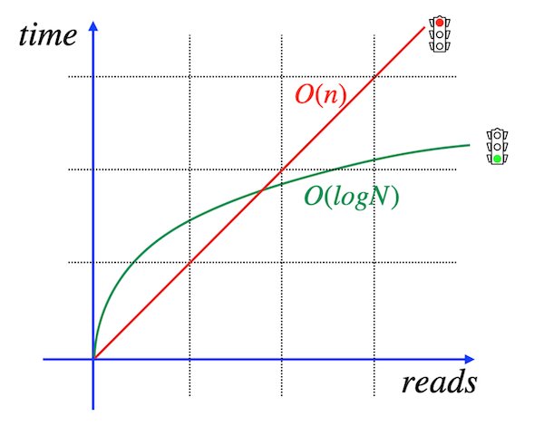

# Day 05 - Piscine SQL

## _I improved my SQL Query! Please, provide proof!_

Resume: Today you will see how and when to create database indexes

## Contents

1. [Глава I](#chapter-i) \
    1.1. [Преамбула](#preamble)
2. [Глава II](#chapter-ii) \
    2.1. [Основные правила](#general-rules)
3. [Глава III](#chapter-iii) \
    3.1. [Правила дня](#rules-of-the-day)  
4. [Глава IV](#chapter-iv) \
    4.1. [Упражнение 00 - Давайте создадим индексы для каждого внешнего ключа](#exercise-00-lets-create-indexes-for-every-foreign-key)  
5. [Глава V](#chapter-v) \
    5.1. [Упражнение 01 - Как убедиться, что индекс работает?](#exercise-01-how-to-see-that-index-works)  
6. [Глава VI](#chapter-vi) \
    6.1. [Упражнение 02 - Формула находится в указателе. Это нормально?](#exercise-02-formula-is-in-the-index-is-it-ok)  
7. [Глава VII](#chapter-vii) \
    7.1. [Упражнение 03 - Многоколоночный индекс для наших целей](#exercise-03-multicolumn-index-for-our-goals)  
8. [Глава VIII](#chapter-viii) \
    8.1. [Упражнение 04 - Уникальность данных](#exercise-04-uniqueness-for-data)
9. [Глава IX](#chapter-ix) \
    9.1. [Упражнение 05 - Частичная Уникальность данных](#exercise-05-Частичная-uniqueness-for-data)
10. [Глава X](#chapter-x) \
    10.1. [Упражнение 06 - Улучшим производительность](#exercise-06-lets-make-performance-improvement)

## Глава I
## Преамбула


Как индексация делает нас быстрее? Почему один и тот же SQL-запрос с индексом и без индекса имеет разное значение TPS (количество транзакций в секунду)? На самом деле, с «точки зрения пользователя» индекс — это просто «черный ящик» с магией внутри, индекс — это просто организованная структура, и на самом деле никакой магии.

Позвольте мне объяснить, почему индекс существует, но не используется.

|  |  |
| ------ | ------ |
| Пожалуйста, взгляните на картинку, красная линия означает линейное время для поиска данных на основе запроса. Другими словами, если вам нужно что-то найти, вы должны увидеть в каждом блоке, странице, кортеже и создать список строк поиска. (этот термин имеет название «последовательное сканирование»). Собственно, если вы создали индекс BTree, то вы получили прибавку в скорости. Итак, зеленая линия соответствует логарифмическому времени поиска. Представим, если у вас 1000000 строк, и для поиска 1 строки вам нужно, мол... 1 секунда, то всего вам нужно 1000000 секунд, buf с индексом вам нужно ln(1000000) ~ 14 секунд |  |
|  | Но почему... индекс не работает? Честно говоря, есть разные причины, но главная из них основана на общем количестве строк индексируемой таблицы. Пожалуйста, взгляните на картинку, я нарисовал жирную синюю линию, это путь для поиска алгоритмов. Как видите, линейное время в начале больше всего подходит для алгоритмов вместо использования логарифмического поиска. Как определить эту точку пересечения? В принципе могу порекомендовать эксперименты, бенчмарки и… вашу интуицию. Вообще никаких формул. Поэтому иногда, если вы хотите сравнить результаты вашего поиска, вам нужно явно отключить последовательное сканирование. Например, в PostgreSQL есть специальная команда set enable_seqscan =off. |

## Глава II
## Основные правила

- Используйте эту страницу как единственную инструкцию. Не слушайте никаких слухов и домыслов о том, как подготовить своё решение.
- Пожалуйста, убедитесь, что вы используете последнюю версию PostgreSQL.
- Это совершенно нормально, если вы используете IDE для написания исходного кода (он же SQL-скрипт).
- Для оценки ваше решение должно находиться в вашем репозитории GIT.
- Ваши решения будут оценены вашими товарищами по интенсиву.
- Вы не должны оставлять в своем каталоге никаких других файлов, кроме тех, которые явно указаны в инструкциях к упражнению. Рекомендуется изменить ваш .gitignoreчтобы избежать случайностей.
- У вас есть вопрос? Спросите у соседа справа. Если не помогло - попробуйте с соседом слева.
- Ваш справочник: товарищи/интернет/гугл.
- Внимательно прочитайте примеры. Они могут понять вещи, которые иначе не указаны в задании. 
- И да прибудет с вами сила SQL!
- Абсолютно все можно представить в SQL! Давайте начнем и получайте удовольствие!

## Глава III
## Правила дня

- Убедитесь, что у вас есть собственная база данных и доступ к ней в вашем кластере PostgreSQL.
- Загрузите скрипт (materials/model.sql) с моделью базы данных здесь и примените его к своей базе данных (вы можете использовать командную строку с psql или просто запустить его через любую IDE, например DataGrip от JetBrains или pgAdmin от сообщества PostgreSQL).
- Все задачи содержат список разрешенных и запрещенных разделов с перечисленными параметрами базы данных, типами баз данных, конструкциями SQL и т. д. Пожалуйста, ознакомьтесь с разделом перед началом.
- Пожалуйста, взгляните на логическое представление нашей модели базы данных.


1. Таблица **pizzeria** (Таблица-словарь с доступными пиццериями)
- поле ``id`` - первичный ключ (primary key)
- поле ``name`` - название пиццерии
- поле ``rating`` - средний рейтинг пиццерии (от 0 до 5 баллов)
2. Таблица **person** (Таблица-словарь с людьми, которые любят пиццу)
- поле ``id`` - первичный ключ (primary key)
- поле ``name`` - имя человека
- поле ``age`` - возраст человека
- поле ``gender`` - пол человека
- поле ``address`` - адрес человека
3. Таблица **menu** (Таблица-словарь с доступным меню и ценой на конкретную пиццу)
- поле ``id`` - первичный ключ (primary key)
- поле ``pizzeria_id`` - внешний ключ к пиццерии
- поле ``pizza_name`` - название пиццы в пиццерии
- поле ``price`` - цена конкретной пиццы
4. Таблица **person_visits** (Операционная таблица с информацией о посещениях пиццерии)
- поле ``id`` - первичный ключ (primary key)
- поле ``person_id`` - внешний ключ к человеку
- поле ``pizzeria_id`` - внешний ключ к пиццерии
- поле ``visit_date`` - дата (например 2022-01-01) посещения пиццерии человеком
5. Таблица **person_order** (операционная таблица с информацией о заказах людей)
- поле ``id`` - первичный ключ (primary key)
- поле ``person_id`` - внешний ключ к человеку
- поле ``menu_id`` - внешний ключ к меню
- поле ``order_date`` - дата (например 2022-01-01) заказа человека

Посещение (visit_date) и заказ (order_date) - это разные сущности, и нет никакой корреляции между их данными. Например, клиент может находиться в одном месте (просто просматривая меню) и в это время сделать заказ в другом по телефону или с помощью мобильного приложения. Или позвонить из дома с заказом без каких-либо визитов.

## Глава IV
## Упражнение 00 - Давайте создадим индексы для каждого внешнего ключа

| Упражнение 00: Давайте создадим индексы для каждого внешнего ключа |                                                                                                                          |
|---------------------------------------|--------------------------------------------------------------------------------------------------------------------------|
| Каталог сдачи                     | ex00                                                                                                                     |
| Файлы для сдачи                      | `day05_ex00.sql`                                                                                 |
| **Разрешено**                               |                                                                                                                          |
| Язык                        | ANSI SQL                                                                                              |

Пожалуйста, создайте простой индекс BTree для каждого внешнего ключа в нашей базе данных. Шаблон имени должен удовлетворять следующему правилу «idx_{table_name}_{column_name}». Например, имя индекса BTree для столбца ``pizzeria_id`` в таблице `menu` - `idx_menu_pizzeria_id`.

## Глава V
## Упражнение 01 - Как убедиться, что индекс работает?

| Упражнение 01: Как убедиться, что индекс работает?|                                                                                                                          |
|---------------------------------------|--------------------------------------------------------------------------------------------------------------------------|
| Каталог сдачи                     | ex01                                                                                                                     |
| Файлы для сдачи                      | `day05_ex01.sql`                                                                                 |
| **Разрешено**                               |                                                                                                                          |
| Язык                        | ANSI SQL                                                                                              |

Прежде чем написать оператор SQL, который возвращает названия пицц и соответствующих им пиццерий. Пожалуйста, взгляните на пример результата ниже.

| pizza_name | pizzeria_name | 
| ------ | ------ |
| cheese pizza | Pizza Hut |
| ... | ... |

Давайте предоставим доказательства того, что ваши индексы работают для вашего SQL. Образец доказательства является результатом команды `EXPLAIN ANALYZE`. 
 Пожалуйста, взгляните на пример вывода команды.

```
    ->  Index Scan using idx_menu_pizzeria_id on menu m  (...)
```

**Подсказка**: подумайте, почему ваши индексы не работают напрямую и что нам нужно сделать, чтобы это включить?


## Глава VI
## Упражнение 02 - Формула находится в указателе. Это нормально?

| Упражнение 02: Формула находится в указателе. Это нормально?|                                                                                                                          |
|---------------------------------------|--------------------------------------------------------------------------------------------------------------------------|
| Каталог сдачи                     | ex02                                                                                                                     |
| Файлы для сдачи                      | `day05_ex02.sql`                                                                                 |
| **Разрешено**                               |                                                                                                                          |
| Язык                        | ANSI SQL                                                                                              |

Пожалуйста, создайте функциональный индекс B-Tree с именем `idx_person_name` для имени столбца таблицы `person`. Индекс должен содержать имена людей в верхнем регистре.

Пожалуйста, напишите и предоставьте любой SQL с доказательством (`EXPLAIN ANALYZE`), что индекс idx_person_name работает.

## Глава VII
## Упражнение 03 - Многоколоночный индекс для наших целей

| Упражнение 03: Многоколоночный индекс для наших целей |                                                                                                                          |
|---------------------------------------|--------------------------------------------------------------------------------------------------------------------------|
| Каталог сдачи                     | ex03                                                                                                                     |
| Файлы для сдачи                      | `day05_ex03.sql`                                                                                 |
| **Разрешено**                               |                                                                                                                          |
| Язык                        | ANSI SQL                                                                                              |

Пожалуйста, создайте лучший многоколоночный индекс B-Tree с именем `idx_person_order_multi` для оператора SQL ниже.

```
SELECT person_id, menu_id,order_date
FROM person_order
WHERE person_id = 8 AND menu_id = 19;
```

Команда `EXPLAIN ANALYZE` должна вернуть следующий шаблон. Пожалуйста, обратите внимание на сканирование "Только по индексу"!

```
Index Only Scan using idx_person_order_multi on person_order ...
```

Пожалуйста, предоставьте любой SQL с доказательством (`EXPLAIN ANALYZE`) того, что индекс `idx_person_order_multi` работает.

## Глава VIII
## Упражнение 04 - Уникальность данных

| Упражнение 04: Уникальность данных |                                                                                                                          |
|---------------------------------------|--------------------------------------------------------------------------------------------------------------------------|
| Каталог сдачи                     | ex04                                                                                                                     |
| Файлы для сдачи                      | `day05_ex04.sql`                                                                                 |
| **Разрешено**                               |                                                                                                                          |
| Язык                        | ANSI SQL                                                                                              |

Пожалуйста, создайте уникальный индекс BTree с именем `idx_menu_unique` в таблице `menu` для колонок `pizzeria_id` и `pizza_name`.
Пожалуйста, напишите и предоставьте любой SQL с доказательством (`EXPLAIN ANALYZE`) этот индекс `idx_menu_unique` работает. 

## Глава IX
## Упражнение 05 - Частичная Уникальность данных

| Упражнение 05: Частичная Уникальность данных |                                                                                                                          |
|---------------------------------------|--------------------------------------------------------------------------------------------------------------------------|
| Каталог сдачи                     | ex05                                                                                                                     |
| Файлы для сдачи                      | `day05_ex05.sql`                                                                                 |
| **Разрешено**                               |                                                                                                                          |
| Язык                        | ANSI SQL                                                                                              |

Пожалуйста, создайте частично уникальный индекс BTree с именем `idx_person_order_order_date` в таблице `person_order` для атрибутов `person_id` и `menu_id` с частичной уникальностью для столбца order_date для даты «2022-01-01». 

Команда `EXPLAIN ANALYZE` должна вернуть следующий шаблон:

```
Index Only Scan using idx_person_order_order_date on person_order …
```

## Глава X
## Упражнение 06 - Улучшим производительность


| Упражнение 06: Улучшим производительность|                                                                                                                          |
|---------------------------------------|--------------------------------------------------------------------------------------------------------------------------|
| Каталог сдачи                     | ex06                                                                                                                     |
| Файлы для сдачи                      | `day05_ex06.sql`                                                                                 |
| **Разрешено**                               |                                                                                                                          |
| Язык                        | ANSI SQL                                                                                              |

Пожалуйста, взгляните на приведенный ниже SQL с технической точки зрения (игнорируйте логический вариант этого оператора SQL).

```
SELECT
    m.pizza_name AS pizza_name,
    max(rating) OVER (PARTITION BY rating ORDER BY rating ROWS BETWEEN UNBOUNDED PRECEDING AND UNBOUNDED FOLLOWING) AS k
FROM  menu m
INNER JOIN pizzeria pz ON m.pizzeria_id = pz.id
ORDER BY 1,2;
```

Создайте новый индекс BTree с именем `idx_1` что должно улучшить показатель «Время выполнения» этого SQL. Пожалуйста, предоставьте доказательства (`EXPLAIN ANALYZE`), что SQL был улучшен.

**Подсказка**: это упражнение выглядит как задача «грубой силы», чтобы найти хороший покрывающий индекс, поэтому перед новым тестом удалите индекс `idx_1`.

Пример моего улучшения:

**До**:

```
Sort  (cost=26.08..26.13 rows=19 width=53) (actual time=0.247..0.254 rows=19 loops=1)
"  Sort Key: m.pizza_name, (max(pz.rating) OVER (?))"
Sort Method: quicksort  Memory: 26kB
->  WindowAgg  (cost=25.30..25.68 rows=19 width=53) (actual time=0.110..0.182 rows=19 loops=1)
        ->  Sort  (cost=25.30..25.35 rows=19 width=21) (actual time=0.088..0.096 rows=19 loops=1)
            Sort Key: pz.rating
            Sort Method: quicksort  Memory: 26kB
            ->  Merge Join  (cost=0.27..24.90 rows=19 width=21) (actual time=0.026..0.060 rows=19 loops=1)
                    Merge Cond: (m.pizzeria_id = pz.id)
                    ->  Index Only Scan using idx_menu_unique on menu m  (cost=0.14..12.42 rows=19 width=22) (actual time=0.013..0.029 rows=19 loops=1)
                        Heap Fetches: 19
                    ->  Index Scan using pizzeria_pkey on pizzeria pz  (cost=0.13..12.22 rows=6 width=15) (actual time=0.005..0.008 rows=6 loops=1)
Planning Time: 0.711 ms
Execution Time: 0.338 ms
```

**После**:

```
Sort  (cost=26.28..26.33 rows=19 width=53) (actual time=0.144..0.148 rows=19 loops=1)
"  Sort Key: m.pizza_name, (max(pz.rating) OVER (?))"
Sort Method: quicksort  Memory: 26kB
->  WindowAgg  (cost=0.27..25.88 rows=19 width=53) (actual time=0.049..0.107 rows=19 loops=1)
        ->  Nested Loop  (cost=0.27..25.54 rows=19 width=21) (actual time=0.022..0.058 rows=19 loops=1)
            ->  Index Scan using idx_1 on …
            ->  Index Only Scan using idx_menu_unique on menu m  (cost=0.14..2.19 rows=3 width=22) (actual time=0.004..0.005 rows=3 loops=6)
…
Planning Time: 0.338 ms
Execution Time: 0.203 ms
```
