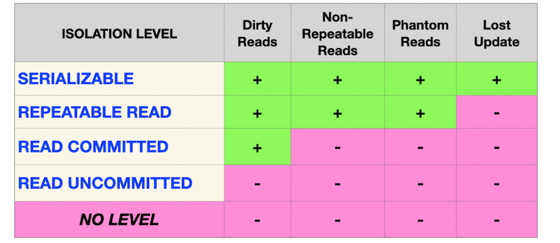
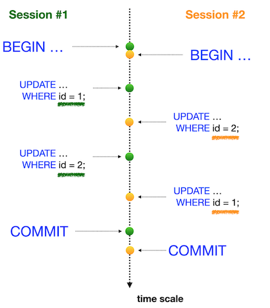

# Day 08 - Piscine SQL

## _Isolation is one of ACID properties_

Resume: Today you will see how database works with transactions and isolation levels

## Contents

1. [Глава I](#chapter-i) \
    1.1. [Преамбула](#preamble)
2. [Глава II](#chapter-ii) \
    2.1. [Основные правила](#general-rules)
3. [Глава III](#chapter-iii) \
    3.1. [Правила дня](#rules-of-the-day)  
4. [Глава IV](#chapter-iv) \
    4.1. [Упражнение 00 - Простая транзакция](#exercise-00-simple-transaction)  
5. [Глава V](#chapter-v) \
    5.1. [Упражнение 01 - Аномалия с потерянными обновлениями](#exercise-01-lost-update-anomaly)  
6. [Глава VI](#chapter-vi) \
    6.1. [Упражнение 02 - Потерянное обновление для повторяющегося чтения](#exercise-02-lost-update-for-repeatable-read)  
7. [Глава VII](#chapter-vii) \
    7.1. [Упражнение 03 - Аномалия неповторяющихся чтений](#exercise-03-non-repeatable-reads-anomaly)  
8. [Глава VIII](#chapter-viii) \
    8.1. [Упражнение 04 - Неповторяющиеся  чтения для сериализации](#exercise-04-non-repeatable-reads-for-serialization)
9. [Глава IX](#chapter-ix) \
    9.1. [Упражнение 05 - Аномалия фантомного чтения](#exercise-05-phantom-reads-anomaly)
10. [Глава X](#chapter-x) \
    10.1. [Упражнение 06 - Фантомные чтения для повторного чтения](#exercise-06-phantom-reads-for-repeatable-read)
11. [Глава XI](#chapter-xi) \
    11.1. [Упражнение 07 - Deadlock](#exercise-07-deadlock)
      

## Глава I
## Преамбула


Лестница Пенроуза или ступеньки Пенроуза, также называемая невозможной лестницей, представляет собой невозможный объект, созданный Лайонелом Пенроузом и его сыном Роджером Пенроузом. Разновидность треугольника Пенроуза, это двухмерное изображение лестницы, в которой лестница делает четыре поворота на 90 градусов при подъеме или спуске, но образует непрерывную петлю, так что человек может подниматься по ней вечно и никогда не получить выше. Это явно невозможно в трех измерениях. «Непрерывная лестница» была впервые представлена ​​в статье, написанной Пенроузами в 1959 году на основе так называемого «треугольника Пенроуза», опубликованного Роджером Пенроузом в «Британском журнале психологии» в 1958 году.

«Лестница Пенроуза» — это математическая аномалия, на самом деле в теории баз данных есть 4 фундаментальные аномалии данных (физические аномалии).

    Аномалия потерянного обновления
    Аномалия грязного чтения
    Неповторяющаяся аномалия чтения
    Аномалия фантомного чтения

Поэтому в стандарте ANSI SQL существуют разные уровни изоляции, которые предотвращают известные аномалии.


С одной стороны, эта матрица должна быть стандартом для каждой реляционной базы данных, но реальность... выглядит немного иначе.

|  |  | |
| ------ | ------ | ------ |
| PostgreSQL |  |
| Oracle |  |
| MySQL |  |

В настоящее время ИТ-сообщество обнаружило ряд новых аномалий, основанных на модели базы данных (логический взгляд).

- Чтение аномалии перекоса
- Напишите аномалию перекоса
- Аномалия сериализации
- Аномалия веерных ловушек
- Аномалия «Ловушки пропасти»
- Аномалия циклов модели данных
и т. д.

## Глава II
## Основные правила

- Используйте эту страницу как единственную инструкцию. Не слушайте никаких слухов и домыслов о том, как подготовить своё решение.
- Пожалуйста, убедитесь, что вы используете последнюю версию PostgreSQL.
- Это совершенно нормально, если вы используете IDE для написания исходного кода (он же SQL-скрипт).
- Для оценки ваше решение должно находиться в вашем репозитории GIT.
- Ваши решения будут оценены вашими товарищами по интенсиву.
- Вы не должны оставлять в своем каталоге никаких других файлов, кроме тех, которые явно указаны в инструкциях к упражнению. Рекомендуется изменить ваш .gitignoreчтобы избежать случайностей.
- У вас есть вопрос? Спросите у соседа справа. Если не помогло - попробуйте с соседом слева.
- Ваш справочник: товарищи/интернет/гугл.
- Внимательно прочитайте примеры. Они могут понять вещи, которые иначе не указаны в задании. 
- И да прибудет с вами сила SQL!
- Абсолютно все можно представить в SQL! Давайте начнем и получайте удовольствие!

## Глава III
## Правила дня

- Убедитесь, что у вас есть собственная база данных и доступ к ней в вашем кластере PostgreSQL.
- Загрузите скрипт (materials/model.sql) с моделью базы данных здесь и примените его к своей базе данных (вы можете использовать командную строку с psql или просто запустить его через любую IDE, например DataGrip от JetBrains или pgAdmin от сообщества PostgreSQL).
- **Наш способ получения знаний является постепенным и линейным, поэтому, пожалуйста, имейте в виду, что все изменения, которые вы внесли в День03 во время упражнений 07-13 и в День04 во время Упражнение 07, должны быть на месте (это похоже на реальный мир, когда мы применили релиз и должны быть согласованы с данными для новых изменений).**
- Все задачи содержат список разрешенных и запрещенных разделов с перечисленными параметрами базы данных, типами баз данных, конструкциями SQL и т. д. Пожалуйста, ознакомьтесь с разделом перед началом.
- Пожалуйста, взгляните на логическое представление нашей модели базы данных.


1. Таблица **pizzeria** (Таблица-словарь с доступными пиццериями)
- поле ``id`` - первичный ключ (primary key)
- поле ``name`` - название пиццерии
- поле ``rating`` - средний рейтинг пиццерии (от 0 до 5 баллов)
2. Таблица **person** (Таблица-словарь с людьми, которые любят пиццу)
- поле ``id`` - первичный ключ (primary key)
- поле ``name`` - имя человека
- поле ``age`` - возраст человека
- поле ``gender`` - пол человека
- поле ``address`` - адрес человека
3. Таблица **menu** (Таблица-словарь с доступным меню и ценой на конкретную пиццу)
- поле ``id`` - первичный ключ (primary key)
- поле ``pizzeria_id`` - внешний ключ к пиццерии
- поле ``pizza_name`` - название пиццы в пиццерии
- поле ``price`` - цена конкретной пиццы
4. Таблица **person_visits** (Операционная таблица с информацией о посещениях пиццерии)
- поле ``id`` - первичный ключ (primary key)
- поле ``person_id`` - внешний ключ к человеку
- поле ``pizzeria_id`` - внешний ключ к пиццерии
- поле ``visit_date`` - дата (например 2022-01-01) посещения пиццерии человеком
5. Таблица **person_order** (операционная таблица с информацией о заказах людей)
- поле ``id`` - первичный ключ (primary key)
- поле ``person_id`` - внешний ключ к человеку
- поле ``menu_id`` - внешний ключ к меню
- поле ``order_date`` - дата (например 2022-01-01) заказа человека

Посещение (visit_date) и заказ (order_date) - это разные сущности, и нет никакой корреляции между их данными. Например, клиент может находиться в одном месте (просто просматривая меню) и в это время сделать заказ в другом по телефону или с помощью мобильного приложения. Или позвонить из дома с заказом без каких-либо визитов.

## Глава IV
## Упражнение 00 - Простая транзакция

| Упражнение 00: Простая транзакция |                                                                                                                          |
|---------------------------------------|--------------------------------------------------------------------------------------------------------------------------|
| Каталог сдачи                     | ex00                                                                                                                     |
| Файлы для сдачи                      | `day08_ex00.sql` с комментариями к заявлениям Сессии №1, Сессии №2; снимок экрана вывода psql для сеанса № 1; снимок экрана вывода psql для сеанса №2 |
| **Разрешено**                               |                                                                                                                          |
| Язык                        |  SQL|

Пожалуйста, для этой задачи используйте командную строку для базы данных PostgreSQL (psql). Вам нужно проверить, как ваши изменения будут опубликованы в базе данных для других пользователей базы данных.

Собственно, нам нужны две активные сессии (имеется в виду 2 параллельные сессии в командных строках).

Пожалуйста, предоставьте доказательство того, что ваш параллельный сеанс не может видеть ваши изменения, пока вы не сделаете `COMMIT`;

Взгляните на шаги ниже.

**Сессия #1**
- обновление рейтинга «Pizza Hut» до 5 баллов в режиме транзакции.
-     убедитесь, что вы видите изменения в сеансе № 1

**Сессия #2**
- убедитесь, что вы не видите изменений в сеансе № 2

**Сессия #1**
- опубликуйте свои изменения для всех параллельных сессий.

**Сессия #2**
- убедитесь, что вы видите изменения в сеансе № 2

Итак, взгляните на пример моего вывода для сеанса № 2.

```
pizza_db=> select * from pizzeria where name  = 'Pizza Hut';
id |   name    | rating
----+-----------+--------
1 | Pizza Hut |    4.6
(1 row)

pizza_db=> select * from pizzeria where name  = 'Pizza Hut';
id |   name    | rating
----+-----------+--------
1 | Pizza Hut |      5
(1 row)
```

Вы можете видеть, что один и тот же запрос возвращает разные результаты, потому что первый был запущен до публикации в сеансе № 1, а второй был запрошен после завершения сеанса № 1.

## Глава V
## Упражнение 01 - Аномалия с потерянными обновлениями

| Упражнение 01: Аномалия с потерянными обновлениями|                                                                                                                          |
|---------------------------------------|--------------------------------------------------------------------------------------------------------------------------|
| Каталог сдачи                     | ex01                                                                                                                     |
| Файлы для сдачи                      | `day08_ex01.sql` с комментариями к заявлениям Сессии №1, Сессии №2; снимок экрана вывода psql для сеанса № 1; снимок экрана вывода psql для сеанса №2                                                                                 |
| **Разрешено**                               |                                                                                                                          |
| Язык                        |  SQL                                                                                              |

Пожалуйста, для этой задачи используйте командную строку для базы данных PostgreSQL (psql). Вам нужно проверить, как ваши изменения будут опубликованы в базе данных для других пользователей базы данных.

Собственно, нам нужны две активные сессии (имеется в виду 2 параллельные сессии в командных строках).

Перед выполнением задачи убедитесь, что вы находитесь на уровне изоляции по умолчанию в своей базе данных. Просто запустите следующий оператор

`SHOW TRANSACTION ISOLATION LEVEL;`

и результат должен быть «read commit»;

Если нет, то установите уровень изоляции «чтение зафиксировано» явно на уровне сеанса. 

|  |  |
| ------ | ------ |
| Давайте проверим один из известных шаблонов базы данных «Аномалия потерянных обновлений». Вы можете увидеть графическое представление этой аномалии на картинке. Горизонтальная красная линия означает окончательные результаты после всех последовательных шагов для обеих сессий. |  |

Пожалуйста, проверьте рейтинг «Pizza Hut» в режиме транзакций для обеих сессий и после этого сделайте `UPDATE` рейтинга до значения 4 в сессии №1 и сделать `UPDATE` рейтинга до значения 3,6 в сеансе №2 (в том же порядке, что и на картинке).

## Глава VI
## Упражнение 02 - Потерянное обновление для повторяющегося чтения

| Упражнение 02: Потерянное обновление для повторяющегося чтения|                                                                                                                          |
|---------------------------------------|--------------------------------------------------------------------------------------------------------------------------|
| Каталог сдачи                     | ex02                                                                                                                     |
| Файлы для сдачи                      | `day08_ex02.sql` с комментариями к заявлениям Сессии №1, Сессии №2; снимок экрана вывода psql для сеанса № 1; снимок экрана вывода psql для сеанса № 2                                                                                 |
| **Разрешено**                               |                                                                                                                          |
| Язык                        |  SQL                                                                                              |

Пожалуйста, для этой задачи используйте командную строку для базы данных PostgreSQL (psql). Вам нужно проверить, как ваши изменения будут опубликованы в базе данных для других пользователей базы данных.

Собственно, нам нужны две активные сессии (имеется в виду 2 параллельные сессии в командных строках). 

|  |  |
| ------ | ------ |
| Давайте проверим один из известных шаблонов базы данных «Аномалия потерянных обновлений», но под REPEATABLE READуровень изоляции. Вы можете увидеть графическое представление этой аномалии на картинке. Горизонтальная красная линия означает окончательные результаты после всех последовательных шагов для обеих сессий. |  |

Пожалуйста, проверьте рейтинг «Pizza Hut» в режиме транзакций для обеих сессий и после этого сделайте `UPDATE` рейтинга до значения 4 в сессии №1 и сделать `UPDATE`рейтинга до значения 3,6 в сеансе №2 (в том же порядке, что и на картинке).

## Глава VII
## Упражнение 03 - Аномалия неповторяющихся чтений

| Упражнение 03: Аномалия неповторяющихся чтений |                                                                                                                          |
|---------------------------------------|--------------------------------------------------------------------------------------------------------------------------|
| Каталог сдачи                     | ex03                                                                                                                     |
| Файлы для сдачи                      | `day08_ex03.sql` с комментариями к заявлениям Сессии №1, Сессии №2; снимок экрана вывода psql для сеанса № 1; снимок экрана вывода psql для сеанса №2                                                                               |
| **Разрешено**                               |                                                                                                                          |
| Язык                        |  SQL                                                                                              |

Пожалуйста, для этой задачи используйте командную строку для базы данных PostgreSQL (psql). Вам нужно проверить, как ваши изменения будут опубликованы в базе данных для других пользователей базы данных.

Собственно, нам нужны две активные сессии (имеется в виду 2 параллельные сессии в командных строках). 

|  |  |
| ------ | ------ |
| Давайте проверим один из известных шаблонов базы данных «Неповторяемое чтение», но под `READ COMMITTED` уровень изоляции. Вы можете увидеть графическое представление этой аномалии на картинке. Горизонтальная красная линия означает окончательные результаты после всех последовательных шагов для обеих сессий. |  |

Пожалуйста, проверьте рейтинг «Pizza Hut» в режиме транзакций для обеих сессий и после этого сделайте `UPDATE` рейтинга до значения 3,6 в сеансе №2 (в том же порядке, что и на картинке). 

## Глава VIII
## Упражнение 04 - Неповторяющиеся  чтения для сериализации

| Упражнение 04: Неповторяющиеся  чтения для сериализации |                                                                                                                          |
|---------------------------------------|--------------------------------------------------------------------------------------------------------------------------|
| Каталог сдачи                     | ex04                                                                                                                     |
| Файлы для сдачи                      | `day08_ex04.sql` с комментариями к заявлениям Сессии №1, Сессии №2; снимок экрана вывода psql для сеанса № 1; снимок экрана вывода psql для сеанса №2                                                                                 |
| **Разрешено**                               |                                                                                                                          |
| Язык                        |  SQL                                                                                              |

Пожалуйста, для этой задачи используйте командную строку для базы данных PostgreSQL (psql). Вам нужно проверить, как ваши изменения будут опубликованы в базе данных для других пользователей базы данных.

Собственно, нам нужны две активные сессии (имеется в виду 2 параллельные сессии в командных строках).

|  |  |
| ------ | ------ |
| Давайте проверим один из известных шаблонов базы данных «Неповторяемое чтение», но под `SERIALIZABLE` уровень изоляции. Вы можете увидеть графическое представление этой аномалии на картинке. Горизонтальная красная линия означает окончательные результаты после всех последовательных шагов для обеих сессий. |  |

Пожалуйста, проверьте рейтинг «Pizza Hut» в режиме транзакций для обеих сессий и после этого сделайте `UPDATE` рейтинга до значения 3.0 в сеансе №2 (в том же порядке, что и на картинке).

## Глава IX
## Упражнение 05 - Аномалия фантомного чтения

| Упражнение 05: Аномалия фантомного чтения|                                                                                                                          |
|---------------------------------------|--------------------------------------------------------------------------------------------------------------------------|
| Каталог сдачи                     | ex05                                                                                                                     |
| Файлы для сдачи                      | `day08_ex05.sql` с комментариями к заявлениям Сессии №1, Сессии №2; снимок экрана вывода psql для сеанса № 1; снимок экрана вывода psql для сеанса №2                                                                                 |
| **Разрешено**                               |                                                                                                                          |
| Язык                        |   SQL                                                                                              |

Пожалуйста, для этой задачи используйте командную строку для базы данных PostgreSQL (psql). Вам нужно проверить, как ваши изменения будут опубликованы в базе данных для других пользователей базы данных.

Собственно, нам нужны две активные сессии (имеется в виду 2 параллельные сессии в командных строках).

|  |  |
| ------ | ------ |
| Давайте проверим один из известных шаблонов базы данных «Phantom Reads», но под `READ COMMITTED`уровень изоляции. Вы можете увидеть графическое представление этой аномалии на картинке. Горизонтальная красная линия означает окончательные результаты после всех последовательных шагов для обеих сессий. |  |

Пожалуйста, суммируйте все рейтинги для всех пиццерий в режиме транзакций для обеих сессий, а затем сделайте `UPDATE` рейтинга на 1 значение для ресторана «Pizza Hut» в сеансе №2 (в том же порядке, что и на картинке). 

## Глава X
## Упражнение 06 - Фантомные чтения для повторного чтения

| Упражнение 06: Фантомные чтения для повторного чтения|                                                                                                                          |
|---------------------------------------|--------------------------------------------------------------------------------------------------------------------------|
| Каталог сдачи                     | ex06                                                                                                                     |
| Файлы для сдачи                      | `day08_ex06.sql`с комментариями к заявлениям Сессии №1, Сессии №2; снимок экрана вывода psql для сеанса № 1; снимок экрана вывода psql для сеанса №2                                                                                 |
| **Разрешено**                               |                                                                                                                          |
| Язык                        |  SQL                                                                                              |

Пожалуйста, для этой задачи используйте командную строку для базы данных PostgreSQL (psql). Вам нужно проверить, как ваши изменения будут опубликованы в базе данных для других пользователей базы данных.

Собственно, нам нужны две активные сессии (имеется в виду 2 параллельные сессии в командных строках).

|  |  |
| ------ | ------ |
| Давайте проверим один из известных шаблонов базы данных «Phantom Reads», но под `REPEATABLE READ` уровень изоляции. Вы можете увидеть графическое представление этой аномалии на картинке. Горизонтальная красная линия означает окончательные результаты после всех последовательных шагов для обеих сессий. |  |


Пожалуйста, суммируйте все рейтинги для всех пиццерий в режиме транзакций для обеих сессий, а затем сделайте `UPDATE`рейтинга до значения 5 для ресторана «Pizza Hut» в сеансе №2 (в том же порядке, что и на картинке).

## Глава XI
## Упражнение 07 - Deadlock

| Упражнение 07: Deadlock|                                                                                                                          |
|---------------------------------------|--------------------------------------------------------------------------------------------------------------------------|
| Каталог сдачи                     | ex07                                                                                                                     |
| Файлы для сдачи                      | `day08_ex07.sql`с комментариями к заявлениям Сессии №1, Сессии №2; снимок экрана вывода psql для сеанса № 1; снимок экрана вывода psql для сеанса №2                                                                                |
| **Разрешено**                               |                                                                                                                          |
| Язык                        |  SQL                                                                                              |

Пожалуйста, для этой задачи используйте командную строку для базы данных PostgreSQL (psql). Вам нужно проверить, как ваши изменения будут опубликованы в базе данных для других пользователей базы данных.

Собственно, нам нужны две активные сессии (имеется в виду 2 параллельные сессии в командных строках).

Давайте воспроизведем ситуацию взаимоблокировки в нашей базе данных.

|  |  |
| ------ | ------ |
| Графическое представление тупиковой ситуации вы можете увидеть на картинке. Похоже на «крест-замок» между параллельными сессиями.  |  |

Пожалуйста, напишите любую инструкцию SQL с любым уровнем изоляции (вы можете использовать настройку по умолчанию) в таблице `pizzeria`, чтобы воспроизвести эту тупиковую ситуацию.

