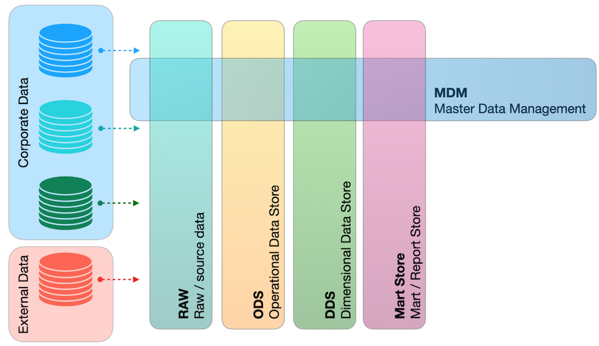
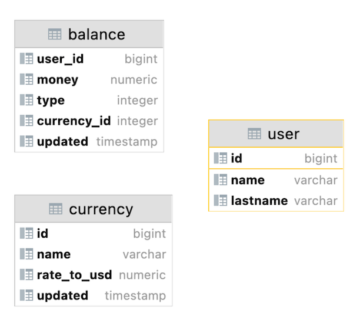
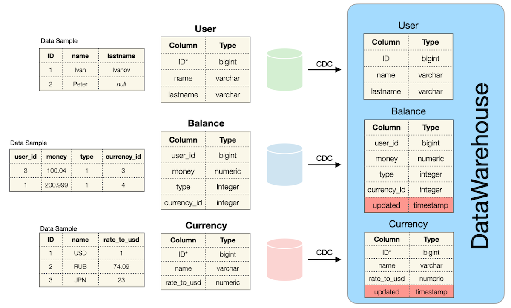

# Team 01 - Piscine SQL

## _Data Warehouse_

Resume: Today you will know what DWH is and how to create a first ETL process

## Contents

1. [Глава I](#chapter-i) \
    1.1. [Преамбула](#preamble)
2. [Глава II](#chapter-ii) \
    2.1. [Основные правила](#general-rules)
3. [Глава III](#chapter-iii) \
    3.1. [Правила дня](#rules-of-the-day)  
4. [Глава IV](#chapter-iv) \
    4.1. [Упражнение 00 - Классический DWH](#exercise-00-classical-dwh)  
5. [Глава V](#chapter-v) \
    5.1. [Упражнение 01 - Подробный запрос](#exercise-01-detailed-query)  

## Глава I
## Преамбула


Хранилище данных (DWH) — это процесс сбора и управления данными из различных источников для предоставления значимой бизнес-аналитики. Хранилище данных обычно используется для подключения и анализа бизнес-данных из разнородных источников. Хранилище данных является ядром системы BI, созданной для анализа данных и составления отчетов.

Есть 2 СХД-«отца» с противоположными мнениями о том, как сделать лучшую СХД из логических слоев данных.

|  |  |
| ------ | ------ |
| «ХД — это предметно-ориентированный, интегрированный, энергонезависимый и изменяющийся во времени набор данных для поддержки решений руководства» (Билл Инмон) |  |
|  | «DWH — это система, которая извлекает, очищает, согласовывает и доставляет исходные данные в многомерное хранилище данных, а затем поддерживает и реализует запросы и анализ для принятия решений» (Ральф Кимбалл) |

В настоящее время большие данные появляются все больше и больше, и нам нужно больше ресурсов для контроля, структурирования и дальнейшего исследования наших данных. Для поддержки классических систем DataWareHouse существует новый шаблон под названием LakeHouse (на основе λ-архитектуры) = DataLake + DataWareHouse. С логической точки зрения современный LakeHouse можно представить как набор логических слоев данных.



Следовательно, чтобы стать архитектором данных, вам нужно знать «немного больше», чем реляционное моделирование. Я хотел бы показать список существующих шаблонов моделей данных.
- Реляционная модель
- Временная модель
- Двухвременная модель
- Модель USS
- Модель ЭАВ
- Модели звёзд / снежинок
- Модель галактики
- Модель хранилища данных
- Якорная модель
- Графическая модель

## Глава II
## Основные правила

- Используйте эту страницу как единственную инструкцию. Не слушайте никаких слухов и домыслов о том, как подготовить своё решение.
- Пожалуйста, убедитесь, что вы используете последнюю версию PostgreSQL.
- Это совершенно нормально, если вы используете IDE для написания исходного кода (он же SQL-скрипт).
- Для оценки ваше решение должно находиться в вашем репозитории GIT.
- Ваши решения будут оценены вашими товарищами по интенсиву.
- Вы не должны оставлять в своем каталоге никаких других файлов, кроме тех, которые явно указаны в инструкциях к упражнению. Рекомендуется изменить ваш .gitignoreчтобы избежать случайностей.
- У вас есть вопрос? Спросите у соседа справа. Если не помогло - попробуйте с соседом слева.
- Ваш справочник: товарищи/интернет/гугл.
- Внимательно прочитайте примеры. Они могут понять вещи, которые иначе не указаны в задании. 
- И да прибудет с вами сила SQL!
- Абсолютно все можно представить в SQL! Давайте начнем и получайте удовольствие!

## Глава III
## Правила дня

- Пожалуйста, убедитесь, что у вас есть собственная база данных и доступ к ней в вашем кластере PostgreSQL.
- Все задачи содержат список разрешенных и запрещенных разделов с перечисленными параметрами базы данных, типами баз данных, конструкциями SQL и т.д. Пожалуйста, ознакомьтесь с этим разделом, прежде чем начать.
- Пожалуйста, скачайте [скрипт] (materials/rush01_model.sql) с моделью базы данных здесь и примените скрипт к вашей базе данных (вы можете использовать командную строку с psql или просто запустить его через любую IDE, например DataGrip от JetBrains или pgAdmin от PostgreSQL community).
- Пожалуйста, взгляните на логический вид нашей модели базы данных.




## Глава IV
## Упражнение 00 - Классический DWH

| Упражнение 00: Классический DWH|                                                                                                                          |
|---------------------------------------|--------------------------------------------------------------------------------------------------------------------------|
| Каталог сдачи                     | ex00                                                                                                                     |
| Файлы для сдачи                      | `team01_ex00.sql`                                                                           |
| **Разрешено**                               |                                                                                                                          |
| Язык                        |  SQL|

Давайте взглянем на источники данных и первый уровень логических данных (ODS — Operational Data Store) в DWH.



Определение таблицы `User` (в базе данных Green Source): 

| Column Name | Description |
| ------ | ------ |
| ID | Primary Key |
| name | Name of User |
| lastname | Last name of User |

Определение таблицы `Currency` (в базе данных Red Source):

| Column Name | Description |
| ------ | ------ |
| ID | Primary Key |
| name | Currency Name |
| rate_to_usd | Ratio to USD currency |

Определение таблицы `Balance` (в базе данных Blue Source):

| Column Name | Description |
| ------ | ------ |
| user_id | “Virtual Foreign Key” to User table from other source |
| money | Amount of money |
| type | Type of balance (can be 0,1,...) |
| currency_id | “Virtual Foreign Key” to Currency table from other source |

Зеленая, красная и синяя базы данных являются независимыми источниками данных и соответствуют шаблону микросервиса. Это означает, что существует высокий риск аномалий данных (представленных ниже).
- Таблицы не в согласованности данных. Это означает, что есть Пользователь, но нет ни одной строки в таблице Баланс, или наоборот, Баланс есть, а в таблице Пользователь нет строк. Такая же ситуация между таблицами Currency и Balance. (другими словами, между ними не существует явных внешних ключей)
- Возможные значения NULL для имени и фамилии в таблице пользователей
- Все таблицы работают под OLTP (OnLine Transactional Processing) SQL-трафиком. Это означает, что существует фактическое состояние данных в определенный момент времени, исторические изменения не сохраняются для каждой таблицы.

Эти 3 перечисленные таблицы являются источниками данных для таблиц с аналогичными моделями данных в области DWH.

Определение таблицы `User` (в базе данных DWH): 

| Column Name | Description |
| ------ | ------ |
| ID | Primary Key |
| name | Name of User |
| lastname | Last name of User |

Определение таблицы `Currency` (в базе данных DWH): 

| Column Name | Description |
| ------ | ------ |
| ID | Mocked Primary Key |
| name | Currency Name |
| rate_to_usd | Ratio to USD currency |
| updated | Timestamp of event from source database |

`Mocked Primary Key` означает, что есть дубликаты с тем же идентификатором, потому что был добавлен новый обновленный атрибут, который преобразует нашу реляционную модель во временную реляционную модель.

Пожалуйста, ознакомьтесь с образцом данных для валюты «EUR» ниже. Этот образец основан на операторе SQL

```
    SELECT *
    FROM Currency
    WHERE name = ‘EUR’
    ORDER BY updated DESC;
```

| ID | name | rate_to_usd | updated |
| ------ | ------ | ------ | ------ |
| 100 | EUR | 0.9 | 03.03.2022 13:31 |
| 100 | EUR | 0.89 | 02.03.2022 12:31 |
| 100 | EUR | 0.87 | 02.03.2022 08:00 |
| 100 | EUR | 0.9 | 01.03.2022 15:36 |
| ... | ... | ... | ... |

Определение таблицы `Balance` (в базе данных DWH): 

| Column Name | Description |
| ------ | ------ |
| user_id | “Virtual Foreign Key” to User table from other source |
| money | Amount of money |
| type | Type of balance (can be 0,1,...) |
| currency_id | “Virtual Foreign Key” to Currency table from other source |
| updated | Timestamp of event from source database |

Пожалуйста, взгляните на образец данных ниже. Этот образец основан на операторе SQL

```
    SELECT *
    FROM Balance
    WHERE user_id = 103
    ORDER BY type, updated DESC;
```

| user_id | money | type | currency_id | updated |
| ------ | ------ | ------ | ------ | ------ |
| 103 | 200 | 0 | 100 | 03.03.2022 12:31 |
| 103 | 150 | 0 | 100 | 02.03.2022 11:29 |
| 103 | 15 | 0 | 100 | 03.03.2022 08:00 |
| 103 | -100 | 1 | 102 | 01.03.2022 15:36 |
| 103 | 2000 | 1 | 102 | 12.12.2021 15:36 |
| ... | ... | ... | ... |... |

Все таблицы в DWH также наследуют все аномалии от исходных таблиц.
- Таблицы не соответствуют данным.
- Возможные значения NULL для имени и фамилии в таблице пользователей

Пожалуйста, напишите оператор SQL, который возвращает общий объем (сумму всех денег) транзакций с баланса пользователя, агрегированных по пользователю и типу баланса. Имейте в виду, что все данные должны быть обработаны, включая данные с аномалиями. Ниже представлена ​​таблица столбцов результатов и соответствующая формула расчета.

| Output Column | Formula (pseudocode) |
| ------ | ------ |
| name | источник: user.name, если user.name равно NULL, тогда возврат значения `not defined` |
| lastname | источник: user.lastname, если user.lastname имеет значение NULL, тогда возврат значения `not defined` |
| type | источник: balance.type | 
| volume | источник: balance.money нужно суммировать все денежные «движения» | 
| currency_name | источник: валюта.имя, если валюта.имя имеет значение NULL, то возврат значения `not defined` | 
| last_rate_to_usd | источник: currency.rate_to_usd. взять последний currency.rate_to_usd для соответствующей валюты, если currency.rate_to_usd равен NULL, вернуть 1 | 
| total_volume_in_usd | источник: объем, last_rate_to_usd. сделать умножение между объемом и last_rate_to_usd |

Пожалуйста, взгляните на образец выходных данных ниже. Отсортируйте результат по имени пользователя в порядке убывания, а затем по фамилии пользователя и типу баланса в порядке возрастания.

| name | lastname | type | volume | currency_name | last_rate_to_usd | total_volume_in_usd |
| ------ | ------ | ------ | ------ | ------ | ------ | ------ |
| Петр | not defined | 2 | 203 | not defined | 1 | 203 |
| Иван | Иванов | 1 | 410 | EUR | 0.9 | 369 |
| ... | ... | ... | ... | ... | ... | ... |


## Глава V
## Упражнение 01 - Подробный запрос

| Упражнение 01: Подробный запрос|                                                                                                                          |
|---------------------------------------|--------------------------------------------------------------------------------------------------------------------------|
| Каталог сдачи                     | ex01                                                                                                                     |
| Файлы для сдачи                      | `team01_ex01.sql`                                                                             |
| **Разрешено**                               |                                                                                                                          |
| Язык                        | ANSI SQL|

Прежде чем углубляться в эту задачу, пожалуйста, примените операторы INSERT ниже.

`insert into currency values (100, 'EUR', 0.85, '2022-01-01 13:29');`
`insert into currency values (100, 'EUR', 0.79, '2022-01-08 13:29');`

Пожалуйста, напишите оператор SQL, который возвращает всех пользователей, все балансовые транзакции (в этой задаче игнорируйте валюты, у которых нет ключа в таблице `Currency`) с названием валюты и расчетным значением валюты в долларах США на ближайший день.

Ниже представлена ​​таблица столбцов результатов и соответствующая формула расчёта.

| Output Column | Formula (pseudocode) |
| ------ | ------ |
| name | источник: user.name, если user.name равно NULL, тогда возврат значения `not defined` |
| lastname | источник: user.lastname, если user.lastname имеет значение NULL, тогда возврат значения `not defined` |
| currency_name | источник: валюта.название | 
| currency_in_usd | задействованные источники: currency.rate_to_usd, currency.updated, balance.updated. Взгляните на графическую интерпретацию формулы ниже. | 


- нужно найти ближайшее значение rate_to_usd валюты в прошлом (t1)
- если t1 пуст (означает отсутствие курсов в прошлом), то найти ближайшее значение rate_to_usd валюты в будущем (t2)
- используйте курс t1 OR t2 для расчета валюты в формате USD

Пожалуйста, взгляните на образец выходных данных ниже. Отсортируйте результат по имени пользователя в порядке убывания, а затем по фамилии пользователя и названию валюты в порядке возрастания.

| name | lastname | currency_name | currency_in_usd |
| ------ | ------ | ------ | ------ |
| Иван | Иванов | EUR | 150.1 |
| Иван | Иванов | EUR | 17 |
| ... | ... | ... | ... |


